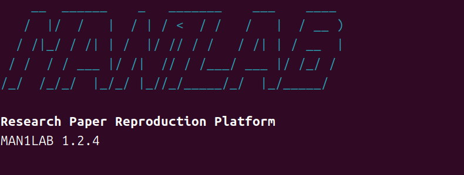

# Man1Lab

**Engineering-first autonomous research paper reproduction platform.**

Man1Lab transforms AI paper reproduction into a structured engineering workflow.

Starting from a research paper, it analyzes the methodology, discovers official repositories and resources, builds an execution strategy, and prepares everything required for software reproduction.

**From paper → engineering decisions → reproducible implementation.**

[](https://pypi.org/project/man1lab/)
[](https://pypi.org/project/man1lab/)
[](https://github.com/maniac1um/Man1Lab/releases)
[](docs/CURRENT_STATUS.md)
[](LICENSE)



---

## Why Man1Lab?

Reproducing modern AI papers is rarely just reading code.

A typical workflow requires:

- Reading and understanding the paper
- Finding the official implementation
- Locating checkpoints and datasets
- Preparing the runtime environment
- Connecting paper concepts to source code
- Planning how the reproduction should actually be executed

**Man1Lab automates this engineering workflow.**

Instead of starting from scattered resources, you start from structured engineering decisions.

---

## Workflow

```text
Paper
   │
   ▼
Analysis
   │
   ▼
Research Resource Discovery
   │
   ▼
Execution Planning
   │
   ▼
Materialization
   │
   ▼
Execution and Report
```

Each stage produces structured artifacts that become the input of the next stage.

---

## Key Features

- Structured paper analysis
- Evidence-backed research resource discovery
- Engineering-oriented execution planning
- Interactive CLI and Console
- Multi-provider LLM support (OpenAI / DeepSeek / Anthropic)
- Python SDK
- Workspace persistence and resume
- Explainable Decision Trace
- Execution Graph generation
- Golden Benchmark framework

---

## Quick Start

Install:

```bash
pip install man1lab
```

Initialize:

```bash
man1lab init
```

Validate your environment:

```bash
man1lab doctor
```

Run a complete planning pipeline:

```bash
man1lab reproduce paper.pdf
```

Or enter the interactive console:

```bash
man1lab
```

---

## Interactive Console

The interactive console guides the complete engineering workflow.

```text
man1lab
│
├── analyze <paper.pdf>
├── discover
├── plan
├── plan-all <paper.pdf>
├── doctor
├── model
└── profile
```

Workspace artifacts are persisted automatically, allowing interrupted sessions to resume.

---

## Generated Workspace

Running Man1Lab produces structured engineering artifacts.

```text
workspace/
├── analysis/
│   ├── analysis.json
│   └── analysis.md
├── discovery/
│   ├── resources.json
│   └── summary.md
├── planning/
│   ├── execution_strategy.json
│   └── summary.md
├── decision/
│   ├── decision_trace.json
│   └── execution_graph.json
└── logs/
```

These artifacts can be inspected, version-controlled, and reused in later stages.

---

## Current Scope

Man1Lab focuses on **software reproduction** of AI research.

Supported domains include:

- Computer Vision
- Embodied AI (software stack)
- LLM Systems
- Agent Frameworks
- Reinforcement Learning

Hardware deployment, robot calibration, and physical experiments are outside the current scope.

---

## Architecture

```text
Platform
        │
        ▼
Analysis
        │
        ▼
Discovery
        │
        ▼
Execution Planning
        │
        ▼
Execution
```

Interfaces (CLI, Console, SDK) share the same Platform Runtime and Decision Foundation.

Architecture documentation:

- Architecture
- Runtime
- Execution Planning

---

## Roadmap

| Version | Focus |
|----------|------|
| **v1.2.x** | Platform Runtime & Decision Foundation ✅ |
| **v1.3** | Repository Understanding |
| **v1.4** | Repository Adaptation |
| **v1.5** | Knowledge Memory |

---

## Documentation

- Getting Started
- Architecture
- Runtime
- Current Status
- [Project Structure](docs/PROJECT_STRUCTURE.md)
- Roadmap

---

## Citation

```bibtex
@software{man1lab_2026,
  author  = {maniac1um},
  title   = {Man1Lab: An Autonomous Research Paper Reproduction Platform},
  year    = {2026},
  version = {1.3.0},
  url     = {https://github.com/maniac1um/Man1Lab}
}
```

See **CITATION.cff** for the preferred citation format.

---

## License

Released under the MIT License.
