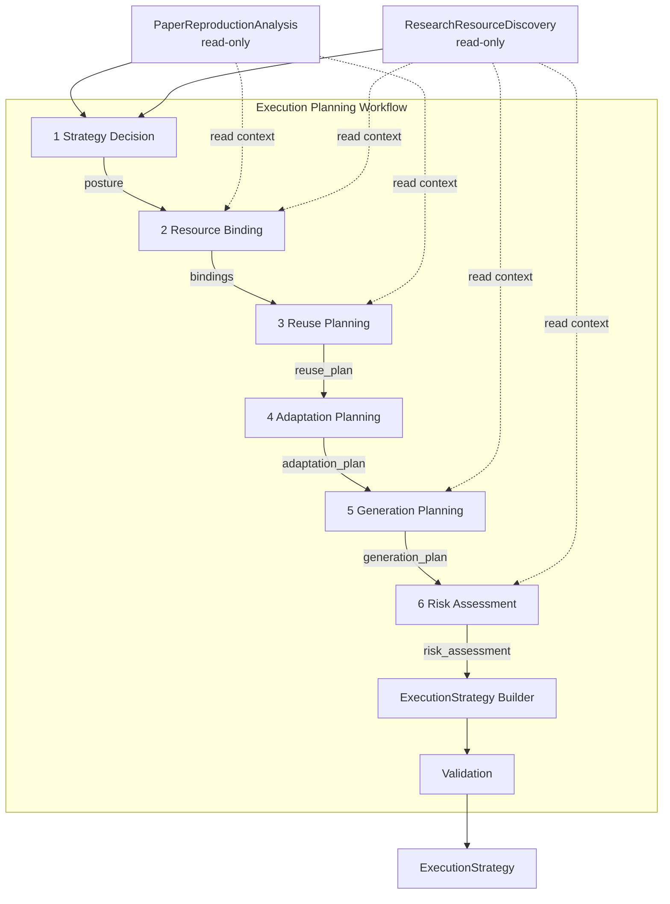

# Execution Planning — Workflow Architecture

**Project:** Man1Lab  
**Phase:** v1.2 — Execution Planning  
**Version:** Workflow design — implemented foundation (Phase 5.2)  
**Status:** Implemented — service/port/provider foundation complete; business reasoning providers pending  
**Last updated:** 2026-07-08

Related documents:

- [ADR-0014](../adr/ADR-0014-Execution-Planning-Capability.md) — capability boundary and ADR decision
- [execution-planning.md](execution-planning.md) — capability design
- [execution-strategy-schema.md](execution-strategy-schema.md) — canonical object schema
- [research-resource-discovery-workflow.md](research-resource-discovery-workflow.md) — upstream workflow pattern
- [ADR-0017](../adr/ADR-0017-Execution-Planning-Service-Architecture.md) — service/port/provider layering

This document describes **how the Execution Planning pipeline runs** — stage order, data flow, invariants, failure handling, and tracking hooks. It does **not** redefine the `ExecutionStrategy` schema (see schema document) and does **not** specify APIs, classes, prompts, or runtime code.

**Out of scope:** Python code, Pydantic models, schema field definitions, ADR changes, provider SDKs, Planner prompts.

---

## 1. Purpose

### 1.1 Why Execution Planning Needs an Independent Workflow

Execution Planning is not a single strategy function or a Planner preamble. It is a **multi-stage, decision-sequenced process** that transforms paper-grounded analysis and evidence-backed discovery into an auditable engineering strategy artifact.

An independent **Execution Planning Workflow** is required because:

| Reason | Explanation |
|--------|-------------|
| **Stage separation** | Posture, binding, reuse, adaptation, generation, and risk have different decision logic and failure modes |
| **Auditability** | Each stage produces inspectable intermediate state mapped to canonical schema modules |
| **Partial completion** | Partial Discovery must still yield a valid strategy with explicit risk acceptance |
| **Layer boundary** | Planning logic must not leak into Discovery, Planner, or Implementation |
| **Strategy before tasks** | Engineering decisions must be committed before task decomposition begins |

The workflow is **internal to the Execution Planning layer**. The platform workflow coordinator invokes Execution Planning as one logical step; the Execution Planning coordinator runs six fixed semantic stages internally, then assembles and validates the canonical artifact.

### 1.2 Core transformation

```text
PaperReproductionAnalysis
        +
ResearchResourceDiscovery
        ↓
Execution Planning Workflow          ← this document
        ↓
ExecutionStrategy                  ← canonical output
```

Execution Planning Workflow **ends** when `ExecutionStrategy` passes structural validation and is emitted — including `partial`, `degraded`, `manual_review`, or `aborted` status. It does not produce tasks, clone repositories, or generate code.

### 1.3 What This Document Answers

| Question | Answered here |
|----------|---------------|
| In what order do planning stages run? | Yes |
| What does each stage read and write? | Yes |
| How does the workflow handle partial or missing Discovery? | Yes |
| How do runtime stage objects flow? | Yes (§4) |
| What invariants must every run satisfy? | Yes (§6) |
| What fields exist on `ExecutionStrategy`? | No — see [schema doc](execution-strategy-schema.md) |

---

## 2. Workflow Position

### 2.1 Platform pipeline

```text
Analysis
    ↓
PaperReproductionAnalysis
    ↓
Discovery
    ↓
ResearchResourceDiscovery
    ↓
Execution Planning Workflow        ← this document
    ↓
ExecutionStrategy
    ↓
Planner
    ↓
TaskModel
    ↓
Implementation
    ↓
Execution
```

### 2.2 Position relative to adjacent layers

| Layer | Role relative to Execution Planning |
|-------|-------------------------------------|
| **Analysis** | Produces read-only input `PaperReproductionAnalysis`. Execution Planning never writes back. |
| **Discovery** | Produces read-only input `ResearchResourceDiscovery`. Execution Planning never re-runs Discovery. |
| **Execution Planning Workflow** | Consumes both artifacts; runs six stages; emits `ExecutionStrategy`. |
| **Planner** | Consumes `ExecutionStrategy`; expands decisions into `TaskModel`. Never recreates strategy. |
| **Implementation** | Consumes `ExecutionStrategy` + `TaskModel`; never infers reuse/adapt/generate. |
| **Execution** | Clone, install, run — occurs only after planning and decomposition. |

### 2.3 Coordinator roles

| Coordinator | Scope |
|-------------|-------|
| **Platform workflow coordinator** | Decides whether to invoke Execution Planning (Discovery complete, user flag, policy); passes analysis + discovery in, receives strategy out |
| **Execution Planning workflow coordinator** | Runs six internal stages via services, then builder assembly + validation; maintains provenance envelope |
| **Execution Planning services** | Orchestrate provider ports per stage; all methods use `execute()` |

Execution Planning internal layering mirrors Discovery ([research-resource-discovery-workflow.md](research-resource-discovery-workflow.md)):

```text
ExecutionPlanningWorkflow
        ↓
Execution Planning Services.execute(...)
        ↓
Provider Ports
        ↓
Providers (Embedded, NoOp)
        ↓
Decision Foundation
        ↓
Runtime Models
        ↓
ExecutionStrategyBuilder.build(...)
        ↓
Validation
        ↓
ExecutionStrategy
```

| Layer | Responsibility |
|-------|----------------|
| Workflow | Orchestration only — stage order, timestamps, builder envelope |
| Services | Provider orchestration, ordering, per-stage merge |
| Ports | Provider contracts (`execute`) |
| Providers | Runtime snapshots from Decision Foundation decisions |
| Decision Foundation | Observed facts, dimensions, per-stage engineering decisions |
| Builder | Canonical assembly — final artifact construction |
| Validation | Structural correctness |

Default provider order: `Embedded*Provider` → `NoOp*Provider` (mirrors Discovery).

**Maturity:** Complete (v1.2.1). Six embedded providers with shared Decision Foundation. See [ADR-0018](../adr/ADR-0018-Execution-Planning-Decision-Foundation.md) and [architecture/EXECUTION_PLANNING.md](../architecture/EXECUTION_PLANNING.md).

---

## 3. Workflow Architecture

### 3.1 Fixed stage pipeline

Execution Planning executes **exactly six semantic stages** in **fixed order**, followed by **assembly** and **structural validation**.

```text
Strategy Decision
        ↓
Resource Binding
        ↓
Reuse Planning
        ↓
Adaptation Planning
        ↓
Generation Planning
        ↓
Risk Assessment
        ↓
ExecutionStrategy Builder
        ↓
Validation
        ↓
ExecutionStrategy
```

### 3.2 Execution rules

| Rule | Meaning |
|------|---------|
| **Fixed order** | Stages always run 1 → 2 → 3 → 4 → 5 → 6. No stage runs before its predecessor completes (success or controlled partial). |
| **No skipping** | Even when Discovery is empty or skipped, all six stages still run (producing explicit posture, empty bindings, and documented risks). |
| **No cross-stage mutation** | A stage writes only its designated decision slice. It does not rewrite prior stage outputs. |
| **Upstream immutability** | `PaperReproductionAnalysis` and `ResearchResourceDiscovery` are read-only for the entire workflow. |
| **Risk does not revise strategy** | Stage 6 records and accepts risks; it does not change posture or bindings decided in Stages 1–5. |
| **Builder is non-semantic** | Assembly maps runtime results to schema modules — no engineering decisions. |
| **Validation is structural only** | Validation checks referential integrity and coherence rules — no strategy inference. |

### 3.3 ExecutionStrategy Builder (assembly)

Assembly is **not** a seventh semantic stage. It does not decide posture, bind resources, or assess risk. It is the **ExecutionStrategy Builder** — a finalization step that converts accumulated stage outputs into the canonical artifact.

```text
RiskAssessmentResult (runtime)
        ↓
ExecutionStrategy Builder            ← NOT a semantic stage
        ↓
Validation                             ← structural checks only
        ↓
ExecutionStrategy (canonical — exits Execution Planning layer)
```

#### What assembly is

| Property | Detail |
|----------|--------|
| **Role** | Artifact construction only |
| **Input** | Accumulated runtime stage results + in-progress builder state |
| **Output** | `ExecutionStrategy` candidate ready for validation |
| **Business logic** | None — no engineering decisions |

#### Builder responsibilities (only)

| Responsibility | Maps to schema module |
|----------------|----------------------|
| Set `schema_version` | Root |
| Finalize `metadata` | `strategy_id`, `created_at`, `status`, `summary`, counts |
| Bind upstream artifacts | `input_references` (analysis + discovery hashes, IDs) |
| Map stage outputs | `strategy`, `resource_bindings`, `reuse_plan`, `adaptation_plan`, `generation_plan`, `risk_assessment` |
| Finalize `provenance` | `stage_timestamps`, `degradation_notes`, `decision_trace` assembly |
| Compute denormalized snapshots | `metadata.strategy_posture`, binding counts |

#### What assembly must never do

| Forbidden | Reason |
|-----------|--------|
| Change `strategy.primary_posture` | Decided in Stage 1 |
| Add or remove bindings | Decided in Stage 2 |
| Authorize adaptation or generation | Decided in Stages 4–5 |
| Re-rank Discovery candidates | Discovery scope |
| Modify upstream artifacts | Layer boundary |
| Produce `TaskModel` | Planner scope |

### 3.4 Validation (structural)

Validation runs **once**, immediately after Builder produces the artifact candidate. It is **not** a semantic stage.

| Property | Detail |
|----------|--------|
| **Role** | Enforce schema validation rules ES-01–ES-23 (see schema doc) |
| **Input** | Assembled `ExecutionStrategy` candidate + linked Discovery artifact for cross-artifact checks |
| **Output** | Validated `ExecutionStrategy` with final `metadata.status` |
| **Business logic** | None — structural and coherence checks only |

| Validation outcome | Behavior |
|--------------------|----------|
| **All rules pass** | Emit with `metadata.status` from Stage 6 hint |
| **Warnings only** | Emit with `metadata.status=partial`; notes in `provenance.degradation_notes` |
| **Blocking structural failure** | Emit with `metadata.status=partial` or `aborted`; record validation failures in `provenance` — never silently discard artifact |

Validation **never** infers missing bindings, change posture, or call external systems.

### 3.5 Mermaid view



---

## 4. Runtime Contracts

Runtime stage contracts describe **conceptual objects flowing between stages** inside the Execution Planning Workflow coordinator. They are **not** the canonical schema, **not** persisted models, and **not** public platform artifacts unless snapshotted for debugging or MLflow.

Only **`ExecutionStrategy`** leaves the Execution Planning layer.

### 4.1 Scope and visibility

| Object kind | Visibility | Lifetime |
|-------------|------------|----------|
| Runtime stage results | Internal to Execution Planning Workflow | One planning execution |
| In-progress builder state | Internal to coordinator + Builder | Until validation completes |
| `ExecutionStrategy` | Platform-wide canonical artifact | Persisted, tracked, replayable |

Stages pass **cumulative state** plus **stage-specific deltas**. Implementations may use one mutable builder or immutable stage results — the contract is semantic, not structural.

### 4.2 Contract chain

```text
PaperReproductionAnalysis + ResearchResourceDiscovery
        ↓
Stage 1 → StrategyDecisionResult
        ↓
Stage 2 → ResourceBindingResult
        ↓
Stage 3 → ReusePlanResult
        ↓
Stage 4 → AdaptationPlanResult
        ↓
Stage 5 → GenerationPlanResult
        ↓
Stage 6 → RiskAssessmentResult
        ↓
Builder → ExecutionStrategy (candidate)
        ↓
Validation → ExecutionStrategy (final)
```

Each runtime result **includes**:

- References to read-only `PaperReproductionAnalysis` and `ResearchResourceDiscovery` (never embedded mutably)
- Cumulative decision state for modules this stage and prior stages own
- Stage metadata: `stage_name`, `started_at`, `completed_at`, `status` (`success`, `partial`, `degraded`, `skipped`)
- `decision_notes` — human-readable stage summary for `provenance.decision_trace`

### 4.3 Stage contracts

#### Stage 1 — Strategy Decision

| | |
|--|--|
| **Input** | `PaperReproductionAnalysis`, `ResearchResourceDiscovery` |
| **Output** | **`StrategyDecisionResult`** |

**StrategyDecisionResult** carries:

- `primary_posture` — committed engineering posture (maps to `strategy.primary_posture`)
- `scope_commitment` — full, partial, narrowed, eval-only, etc.
- `scope_narrowing_rationale` — when scope is reduced
- `rationale` — primary strategy explanation
- `deciding_factors` — named factors from analysis and discovery summaries
- `confidence` — initial strategy confidence (may be adjusted in Stage 6 recording only)
- `alternative_postures_rejected` — audit of rejected postures
- `artifact_status_hint` — `complete`, `partial`, `manual_review`, `aborted` suggestion for metadata
- `stage_status` — `success` or `partial`

#### Stage 2 — Resource Binding

| | |
|--|--|
| **Input** | `StrategyDecisionResult` |
| **Output** | **`ResourceBindingResult`** |

**ResourceBindingResult** carries:

- Pass-through posture from Stage 1
- `bindings` — list of resource binding records (maps to `resource_bindings.bindings`)
- `anchor_binding_id` — primary workspace anchor
- `combination_rationale` — why this resource set is coherent
- `selection_alignment_summary` — how bindings relate to discovery selections
- `stage_status` — `success` or `partial` (partial when posture expects bindings but none could be formed)

#### Stage 3 — Reuse Planning

| | |
|--|--|
| **Input** | `ResourceBindingResult` |
| **Output** | **`ReusePlanResult`** |

**ReusePlanResult** carries:

- Pass-through posture and bindings
- `reuse_mode` — as-is, fork-based, hybrid, not applicable
- `components_to_reuse` — binding-level reuse commitments
- `components_excluded` — discovered but unused resources with reasons
- `reuse_assumptions` — assumptions reuse depends on
- `reuse_limitations` — accepted limitations
- `stage_status` — `success` or `partial`

#### Stage 4 — Adaptation Planning

| | |
|--|--|
| **Input** | `ReusePlanResult` |
| **Output** | **`AdaptationPlanResult`** |

**AdaptationPlanResult** carries:

- Pass-through prior state
- `adaptation_required` — whether modification is authorized downstream
- `adaptation_scope` — none, minimal, moderate, extensive
- `authorized_modifications` — permitted modification classes
- `adaptation_constraints` — what must not change
- `adaptation_triggers` — why adaptation is needed (references discovery gap IDs)
- `adaptation_deferred` — true when Repository Understanding must precede detailed adaptation scope
- `stage_status` — `success` or `partial`

#### Stage 5 — Generation Planning

| | |
|--|--|
| **Input** | `AdaptationPlanResult` |
| **Output** | **`GenerationPlanResult`** |

**GenerationPlanResult** carries:

- Pass-through prior state
- `generation_required` — whether Implementation must generate artifacts
- `generation_scope` — none, full codebase, missing modules, etc.
- `modules_to_generate` — analysis module references (names only, not content)
- `generation_constraints` — framework and interface constraints
- `generation_rationale` — why generation was chosen
- `reuse_fallback_after_generation` — whether discovery resources remain fallbacks
- `stage_status` — `success` or `partial`

#### Stage 6 — Risk Assessment

| | |
|--|--|
| **Input** | `GenerationPlanResult` |
| **Output** | **`RiskAssessmentResult`** |

**RiskAssessmentResult** carries:

- Pass-through prior state (unchanged — Stage 6 does not mutate strategy decisions)
- `overall_confidence` — confidence after risk recording
- `blocking_risks`, `degraded_risks`, `informational_risks`
- `fallback_strategies` — ordered fallback postures and bindings
- `accepted_discovery_gap_ids` — gaps explicitly accepted
- `manual_actions_required` — human steps before Planner proceeds
- `abort_conditions` — conditions under which campaign should stop
- `artifact_status_hint` — final metadata status recommendation
- `stage_status` — `success`, `partial`, or `degraded`

#### Assembly — ExecutionStrategy Builder

| | |
|--|--|
| **Input** | `RiskAssessmentResult` |
| **Output** | **`ExecutionStrategy`** (candidate, pre-validation) |

Builder maps runtime accumulators to canonical modules per schema document.

#### Validation

| | |
|--|--|
| **Input** | `ExecutionStrategy` candidate + `ResearchResourceDiscovery` (for cross-artifact ID checks) |
| **Output** | **`ExecutionStrategy`** (final) |

### 4.4 Runtime vs canonical mapping

| Runtime result field | Canonical module (on assembly) |
|---------------------|--------------------------------|
| Stage 1 posture fields | `strategy` |
| Stage 2 bindings | `resource_bindings` |
| Stage 3 reuse fields | `reuse_plan` |
| Stage 4 adaptation fields | `adaptation_plan` |
| Stage 5 generation fields | `generation_plan` |
| Stage 6 risk fields | `risk_assessment` |
| Upstream artifact IDs and hashes | `input_references` |
| All `decision_notes` | `provenance.decision_trace` |
| Final `artifact_status_hint` | `metadata.status` |

Runtime contracts guide **implementation sequencing**. The schema document remains the **source of truth** for field semantics.

---

## 5. Stage Responsibilities

Each subsection follows: Purpose → Inputs → Outputs → Responsibilities → Non-responsibilities → Failure handling → Stage transition.

Schema module names align with [execution-strategy-schema.md](execution-strategy-schema.md).

---

### 5.1 Stage 1 — Strategy Decision

#### Purpose

Commit the **engineering posture** and **scope commitment** for the reproduction campaign — before binding specific discovery resources.

#### Inputs

| Input | Source |
|-------|--------|
| `PaperReproductionAnalysis` | Platform — goal, scope, reproduction gaps, method/evaluation summaries |
| `ResearchResourceDiscovery` | Platform — metadata status, selection summary, discovery gaps (not full evidence chains) |

#### Outputs

| Output | Maps to |
|--------|---------|
| `StrategyDecisionResult` | `strategy` module (draft) |

#### Responsibilities

- Decide `primary_posture` (official repository, community fork, hybrid, greenfield, manual)
- Commit `scope_commitment` aligned with `goal.scope` and discovery completeness
- Record `rationale`, `deciding_factors`, and rejected alternative postures
- Set initial `confidence` based on discovery status and analysis gap severity
- Recommend `artifact_status_hint` when Discovery is partial or absent

#### Non-responsibilities

- Bind specific `candidate_id` values — Resource Binding
- Authorize adaptation or generation — Stages 4–5
- Assess final risks — Risk Assessment
- Verify candidates — Discovery (already complete)
- Read PDF or call external APIs

#### Failure handling

| Condition | Workflow behavior |
|-----------|-------------------|
| **Discovery `skipped` or missing** | Posture may be `greenfield` or `manual`; `artifact_status_hint=partial` |
| **Discovery `partial`** | Posture may proceed with `scope_commitment=narrowed_scope`; record deciding factors |
| **All discovery gaps blocking** | Posture may be `greenfield`, `manual`, or `aborted` |
| **Ambiguous multiple official** | Posture may be `manual` or `hybrid` with low initial confidence |

#### Stage transition

**Exit criteria:** `primary_posture` and `scope_commitment` are committed.

**Next stage:** Resource Binding — always invoked.

---

### 5.2 Stage 2 — Resource Binding

#### Purpose

Select **which Discovery resources will be used** and in what **roles** — by reference ID only.

#### Inputs

| Input | Source |
|-------|--------|
| `StrategyDecisionResult` | Stage 1 |
| `ResearchResourceDiscovery` | `selection`, `candidate_resources`, `discovery_gaps` |
| `PaperReproductionAnalysis` | Scope context for binding roles |

#### Outputs

| Output | Maps to |
|--------|---------|
| `ResourceBindingResult` | `resource_bindings` module (draft) |

#### Responsibilities

- Create `bindings` referencing `candidate_id` and `selection_id` from Discovery
- Designate `anchor_binding_id` for repo-based postures
- Record `override_rationale` when binding non-primary discovery selection
- Document `combination_rationale` for multi-resource campaigns

#### Non-responsibilities

- Verify candidate viability — Discovery verification is authoritative input
- Re-rank candidates — Discovery ranking is read-only context
- Copy candidate URLs or evidence — reference IDs only
- Inspect repository contents
- Change `primary_posture` — decided in Stage 1

#### Failure handling

| Condition | Workflow behavior |
|-----------|-------------------|
| **Posture requires repo but no selection** | Empty bindings; `stage_status=partial`; Risk Assessment will record blocking risk |
| **Greenfield posture** | Bindings may be empty or reference-only for supporting assets |
| **Manual posture** | Bindings optional; `manual_actions_required` seeded for Stage 6 |

#### Stage transition

**Exit criteria:** Binding list is finalized (possibly empty with documented rationale in notes).

**Next stage:** Reuse Planning — always invoked.

---

### 5.3 Stage 3 — Reuse Planning

#### Purpose

Commit **how much existing engineering artifact will be reused unchanged**.

#### Inputs

| Input | Source |
|-------|--------|
| `ResourceBindingResult` | Stage 2 |
| `StrategyDecisionResult` | Posture context (pass-through) |
| `ResearchResourceDiscovery` | Verification status summaries per bound candidate (read-only) |

#### Outputs

| Output | Maps to |
|--------|---------|
| `ReusePlanResult` | `reuse_plan` module (draft) |

#### Responsibilities

- Set `reuse_mode` consistent with `primary_posture`
- Declare `components_to_reuse` per binding and logical component label
- Record `components_excluded` with exclusion reasons
- Document `reuse_assumptions` and `reuse_limitations`

#### Non-responsibilities

- Inspect repository file trees or README content
- Clone or fetch resources
- Authorize patches — Adaptation Planning
- Commit generation scope — Generation Planning
- Change bindings — Stage 2 is final

#### Failure handling

| Condition | Workflow behavior |
|-----------|-------------------|
| **Verification `fail` on anchor binding** | `reuse_mode` may be `not_applicable`; limitations recorded; Stage 6 accepts risk |
| **Hybrid posture** | Multiple components with mixed reuse extents |
| **Greenfield posture** | `reuse_mode=not_applicable`; exclusions list why discovery resources are not primary |

#### Stage transition

**Exit criteria:** Reuse commitments recorded for all active bindings (or explicit not-applicable).

**Next stage:** Adaptation Planning — always invoked.

---

### 5.4 Stage 4 — Adaptation Planning

#### Purpose

Authorize **whether and how** discovered resources may be modified downstream.

#### Inputs

| Input | Source |
|-------|--------|
| `ReusePlanResult` | Stage 3 |
| `PaperReproductionAnalysis` | Method and framework context for adaptation triggers |
| `ResearchResourceDiscovery` | Partial verification, discovery gaps |

#### Outputs

| Output | Maps to |
|--------|---------|
| `AdaptationPlanResult` | `adaptation_plan` module (draft) |

#### Responsibilities

- Set `adaptation_required` and `adaptation_scope`
- List `authorized_modifications` with authorization level
- Define `adaptation_constraints` (what must not change)
- Record `adaptation_triggers` linked to discovery gap IDs
- Set `adaptation_deferred` when detailed scope requires Repository Understanding

#### Non-responsibilities

- Patch repositories — Repository Adaptation (future)
- Generate code — Generation Planning / Implementation
- Re-verify candidates — Discovery
- Change reuse commitments — Stage 3 is final

#### Failure handling

| Condition | Workflow behavior |
|-----------|-------------------|
| **Official repo as-is posture** | `adaptation_scope=none`, `adaptation_required=false` |
| **Verification partial on anchor** | `adaptation_required=true`, `adaptation_scope=minimal` or `moderate` |
| **Framework mismatch gap** | Triggers recorded; scope may be `extensive` with `human_approval_required` modifications |

#### Stage transition

**Exit criteria:** Adaptation authorization recorded (including explicit `none`).

**Next stage:** Generation Planning — always invoked.

---

### 5.5 Stage 5 — Generation Planning

#### Purpose

Commit **greenfield or partial code generation** when reuse and adaptation are insufficient.

#### Inputs

| Input | Source |
|-------|--------|
| `AdaptationPlanResult` | Stage 4 |
| `PaperReproductionAnalysis` | Module names: method, evaluation, resources (references only) |
| `StrategyDecisionResult` | Posture context |

#### Outputs

| Output | Maps to |
|--------|---------|
| `GenerationPlanResult` | `generation_plan` module (draft) |

#### Responsibilities

- Set `generation_required` and `generation_scope`
- List `modules_to_generate` with analysis module references and priority
- Document `generation_constraints` and `generation_rationale`
- Set `reuse_fallback_after_generation` when discovery resources remain alternates

#### Non-responsibilities

- Generate code or scaffolds — Implementation
- Create tasks — Planner
- Duplicate analysis module content — module names only
- Change adaptation authorization — Stage 4 is final

#### Failure handling

| Condition | Workflow behavior |
|-----------|-------------------|
| **Greenfield posture** | `generation_required=true`, `generation_scope=full_codebase` or narrowed per scope commitment |
| **Official repo reuse** | `generation_required=false`, `generation_scope=none` |
| **Hybrid with missing module** | `generation_scope=missing_modules`; specific `modules_to_generate` listed |

#### Stage transition

**Exit criteria:** Generation commitments recorded (including explicit `none`).

**Next stage:** Risk Assessment — always invoked.

---

### 5.6 Stage 6 — Risk Assessment

#### Purpose

Record **confidence, risks, fallbacks, and accepted gaps** — making degradation explicit without revising strategy.

#### Inputs

| Input | Source |
|-------|--------|
| `GenerationPlanResult` | Stages 1–5 cumulative state |
| `ResearchResourceDiscovery` | `discovery_gaps`, verification summaries, discovery status |
| `PaperReproductionAnalysis` | Gap categories and scope |

#### Outputs

| Output | Maps to |
|--------|---------|
| `RiskAssessmentResult` | `risk_assessment` module (draft) |

#### Responsibilities

- Compute `overall_confidence` from strategy confidence and discovered risks
- Classify `blocking_risks`, `degraded_risks`, `informational_risks`
- Define ordered `fallback_strategies`
- List `accepted_discovery_gap_ids` when campaign proceeds despite gaps
- Record `manual_actions_required` and `abort_conditions`
- Set final `artifact_status_hint` for Builder

#### Non-responsibilities

- Change `primary_posture` — Stage 1 is final
- Add or remove bindings — Stage 2 is final
- Modify reuse, adaptation, or generation plans — Stages 3–5 are final
- Re-run Discovery or fetch new evidence
- Block artifact emission — partial and aborted strategies are valid outputs

#### Failure handling

| Condition | Workflow behavior |
|-----------|-------------------|
| **Blocking risks present** | `artifact_status_hint=aborted` or `manual_review`; risks documented |
| **Degraded risks only** | `artifact_status_hint=degraded` or `partial`; campaign may proceed |
| **Manual posture** | `manual_actions_required` populated; Planner may gate on this |

#### Stage transition

**Exit criteria:** Risk posture recorded; `artifact_status_hint` set.

**Next stage:** ExecutionStrategy Builder — always invoked.

---

## 6. Workflow Invariants

These rules hold for **every** Execution Planning Workflow run. Violation indicates a workflow bug.

### 6.1 Stage purity

| ID | Invariant |
|----|-----------|
| **EP-INV-01** | Strategy Decision performs no resource binding |
| **EP-INV-02** | Resource Binding performs no verification or re-ranking |
| **EP-INV-03** | Reuse Planning performs no repository inspection |
| **EP-INV-04** | Adaptation Planning performs no patching or code generation |
| **EP-INV-05** | Generation Planning performs no code generation |
| **EP-INV-06** | Risk Assessment does not change posture, bindings, or plans from Stages 1–5 |
| **EP-INV-07** | Builder performs no engineering decisions |
| **EP-INV-08** | Validation performs no strategy inference |

### 6.2 Layer boundary

| ID | Invariant |
|----|-----------|
| **EP-INV-10** | Execution Planning never modifies `PaperReproductionAnalysis` |
| **EP-INV-11** | Execution Planning never modifies `ResearchResourceDiscovery` |
| **EP-INV-12** | Execution Planning never reads PDF |
| **EP-INV-13** | Execution Planning never calls GitHub, OpenAlex, HuggingFace, or generic HTTP |
| **EP-INV-14** | Execution Planning never invokes Discovery providers |
| **EP-INV-15** | Execution Planning never creates `TaskModel` |
| **EP-INV-16** | Execution Planning never clones, installs, or executes resources |

### 6.3 Decision source

| ID | Invariant |
|----|-----------|
| **EP-INV-20** | Every engineering decision derives only from `PaperReproductionAnalysis` and `ResearchResourceDiscovery` |
| **EP-INV-21** | No provider names appear in stage decision outputs — only artifact references |
| **EP-INV-22** | Bindings reference Discovery `candidate_id` values — never embed candidate objects |
| **EP-INV-23** | Risk acceptance references Discovery `gap_id` values — never embed gap objects |

### 6.4 Artifact emission

| ID | Invariant |
|----|-----------|
| **EP-INV-30** | Only `ExecutionStrategy` exits the Execution Planning layer |
| **EP-INV-31** | Runtime stage results are never persisted as canonical artifacts (debug snapshots excepted) |
| **EP-INV-32** | Partial and aborted strategies are valid canonical outputs |
| **EP-INV-33** | Every emitted strategy includes `input_references` with content hashes |

---

## 7. Failure Handling

Execution Planning must define behavior for incomplete upstream inputs and difficult strategy postures **without** calling external systems or re-running Discovery.

### 7.1 Missing Discovery

| Condition | Definition | Workflow behavior |
|-----------|------------|-------------------|
| **Discovery not invoked** | No `ResearchResourceDiscovery` artifact supplied | v1.1 compatibility path: posture tends toward `greenfield` or `manual`; empty bindings; high manual-action or abort risk; `metadata.status=partial` |
| **Discovery `skipped`** | Artifact exists with `metadata.status=skipped` | Strategy Decision reads analysis gaps only; posture reflects user-supplied or unknown resources; bindings empty unless analysis embeds URLs in resources module (reference only, not re-verified) |

Strategy is still emitted — Planner and orchestrator decide whether to proceed.

### 7.2 Partial Discovery

| Condition | Workflow behavior |
|-----------|-------------------|
| `metadata.status=partial` on Discovery | Strategy Decision may narrow scope; Resource Binding binds available selections only; Risk Assessment lists `accepted_discovery_gap_ids` |
| Unresolved discovery gaps remain | Recorded as risks — not re-searched |
| Verification partial on selected candidate | Adaptation Planning authorizes minimal modification; risk degraded not blocking unless scope requires pass |

Partial Discovery **does not block** strategy emission. It **does** affect `metadata.status` and risk modules.

### 7.3 Manual posture

| Trigger | Workflow behavior |
|---------|-------------------|
| License blocked, ambiguous official, or policy requires human | Stage 1 commits `primary_posture=manual` |
| Resource Binding | Optional bindings; documents what is known |
| Risk Assessment | `manual_actions_required` populated; `artifact_status_hint=manual_review` |
| Planner | May pause until manual actions complete (orchestrator policy — outside this workflow) |

### 7.4 Greenfield posture

| Trigger | Workflow behavior |
|---------|-------------------|
| No viable discovery selections | Stage 1 commits `primary_posture=greenfield` |
| Resource Binding | Empty or supporting-asset bindings only |
| Reuse Planning | `reuse_mode=not_applicable` |
| Generation Planning | `generation_required=true`; scope per `scope_commitment` |
| Risk Assessment | High generation risk recorded; fallback may reference manual resource supply |

### 7.5 Aborted planning

| Trigger | Workflow behavior |
|---------|-------------------|
| Blocking risks cannot be mitigated | Stage 6 sets `artifact_status_hint=aborted` |
| Builder | Still assembles full schema modules (plans may be minimal) |
| Validation | Emits artifact with `metadata.status=aborted` |
| Planner | Should not decompose tasks without override policy |

Aborted strategy is a **valid canonical artifact** — it records that reproduction should not proceed autonomously.

### 7.6 Stage-level degradation

| Stage failure mode | Recovery |
|--------------------|----------|
| Stage cannot complete logic | `stage_status=partial`; best-effort output; note in `decision_notes` |
| Incoherent upstream state | Risk Assessment records blocking risk; may recommend `aborted` |
| Validation warnings | Emit with `partial` status; never silent discard |

---

## 8. Relationship to Planner

### 8.1 Consumption contract

```text
ExecutionStrategy
        ↓
Planner
        ↓
TaskModel
```

Planner **consumes** `ExecutionStrategy` as the primary engineering input on the target path.

### 8.2 Responsibility split

| Execution Planning Workflow | Planner |
|----------------------------|---------|
| Commits posture and bindings | Expands into ordered tasks |
| Authorizes reuse, adaptation, generation | Emits clone, patch, generate tasks per authorization |
| Records risks and fallbacks | May encode fallback as task chains |
| Emits `ExecutionStrategy` | Emits `TaskModel` |

### 8.3 Planner constraints

| Rule | Meaning |
|------|---------|
| **No strategy recreation** | Planner must not re-decide `primary_posture` or override bindings without orchestrator policy |
| **Strategy expansion only** | Tasks implement strategy — they do not replace it |
| **Conflict resolution** | If task template conflicts with `ExecutionStrategy`, strategy wins (task generation is defective) |
| **Gating** | Planner may refuse decomposition when `metadata.status=aborted` or `manual_review` |

### 8.4 v1.1 compatibility

When `ExecutionStrategy` is absent (legacy path), Planner may still run from Analysis only. That path is **not** the target architecture and does not invalidate this workflow specification.

---

## 9. Relationship to Future Capabilities

Future capabilities attach **after** `ExecutionStrategy` because they depend on **committed engineering direction** — not on raw discovery rankings.

### 9.1 Repository Understanding

| Aspect | Direction |
|--------|-----------|
| **When** | After Execution Planning completes |
| **Input** | `ExecutionStrategy.resource_bindings.anchor_binding_id` + posture |
| **Why not after Discovery** | Understanding a repo before strategy commits wastes effort on candidates never used and lacks adaptation/generation context |

### 9.2 Repository Adaptation

| Aspect | Direction |
|--------|-----------|
| **When** | After Execution Planning; optionally after Repository Understanding |
| **Input** | `ExecutionStrategy.adaptation_plan` |
| **Why not after Discovery** | Adaptation scope is a strategy decision — Discovery verifies facts only |

### 9.3 Environment Preparation

| Aspect | Direction |
|--------|-----------|
| **When** | After Planner produces `TaskModel` |
| **Input** | `ExecutionStrategy` posture + bindings + tasks |
| **Why not after Discovery** | Environment stack depends on strategy family (reuse official env vs greenfield stack) |

```text
ExecutionStrategy
    ↓
Repository Understanding     (repo-based postures)
    ↓
Repository Adaptation        (when adaptation_plan.adaptation_required)
    ↓
Planner → TaskModel
    ↓
Environment Preparation
    ↓
Implementation → Execution
```

---

## 10. MLflow

Execution Planning participates in platform experiment tracking per [ADR-0012](../adr/ADR-0012-Experiment-Tracking-MLflow.md) — without coupling workflow logic to the MLflow SDK at the domain layer.

### 10.1 Nested run pattern

| Aspect | Direction |
|--------|-----------|
| **Parent run** | Platform reproduction run (orchestrator-level) |
| **Nested run** | One `execution_planning` nested run per workflow invocation |
| **Run name** | `execution_planning` or `planning/{strategy_id}` |

### 10.2 Logged artifacts and metrics

| Item | Content |
|------|---------|
| **Artifact** | Serialized `ExecutionStrategy` (canonical JSON or approved format) |
| **Parameters** | `primary_posture`, `scope_commitment`, `metadata.status`, `binding_count`, `discovery_id` (reference) |
| **Metrics** | `blocking_risk_count`, `overall_confidence`, `generation_required` (boolean as 0/1), stage durations |
| **Tags** | `capability=execution_planning`, `schema_version`, `pipeline_version` |

### 10.3 Boundaries

| Rule | Meaning |
|------|---------|
| **Tracking at composition root** | Workflow domain logic does not import `mlflow` |
| **No upstream artifact duplication** | MLflow stores `ExecutionStrategy`; Analysis and Discovery stored as separate artifacts in their nested runs |
| **Partial runs logged** | `metadata.status=partial` strategies are still logged — audit requires failed or degraded planning visibility |

Implementation of the tracking port is infrastructure — not part of this workflow design.

---

## 11. Future Evolution

The six-stage pipeline is **stable for Phase 1**. Additional concerns extend via **optional pre/post hooks** or **nested sub-workflows** without reordering core stages.

### 11.1 Potential future stages (out of scope for Phase 1)

| Stage | Purpose | Attachment point |
|-------|---------|-------------------|
| **Policy Engine** | Enforce org rules (license block, approved postures) | Pre-Stage 1 or post-Stage 6 gate |
| **Cost Estimation** | Estimate compute and API cost of strategy | Post-Stage 6 advisory — does not change strategy |
| **Execution Simulation** | Dry-run feasibility without clone | Post-Stage 6 advisory |
| **Human Approval** | Block emission until user confirms | Post-Validation gate before artifact leaves capability |

None of these replace Strategy Decision through Risk Assessment. They wrap or annotate the fixed pipeline.

### 11.2 Evolution roadmap

```text
v1.2  Execution Planning Workflow     Six stages + Builder + Validation (this document)
v1.3  Policy + Human Approval         Optional gates; same stage order
v1.4  Cost / Simulation advisors      Post-strategy annotations
```

### 11.3 Next implementation documents

| Document | Scope |
|----------|-------|
| **Pydantic models + validation** | Schema §9 rules as runtime validators |
| **Execution Planning coordinator** | Stage orchestration per this workflow |
| **Planner migration** | TaskModel input contract update |
| **Platform coordinator** | Invocation when Discovery completes |

---

## 12. Planning Lifecycle

Planning **lifecycle** describes execution state of one Execution Planning run. It is **runtime-only** — tracked by the workflow coordinator and optionally exposed to platform UI or logs.

**`metadata.status`** on `ExecutionStrategy` is the **final artifact status** written at Validation. It is not a live lifecycle state machine.

### 12.1 Lifecycle states

```text
Created
    ↓
Running (stages 1–6)
    ↓
Assembling
    ↓
Validating
    ↓
Emitted (complete | partial | degraded | manual_review | aborted)
```

### 12.2 Stage timestamp map

`provenance.stage_timestamps` records completion time per stage:

| Key | Stage |
|-----|-------|
| `strategy_decision` | Stage 1 |
| `resource_binding` | Stage 2 |
| `reuse_planning` | Stage 3 |
| `adaptation_planning` | Stage 4 |
| `generation_planning` | Stage 5 |
| `risk_assessment` | Stage 6 |
| `assembly` | Builder |
| `validation` | Validation |

---

## Document Maintenance

| Event | Action |
|-------|--------|
| Pydantic implementation starts | Pin workflow version; link from ADR-0014 |
| Planner migration completes | Update §8.4 |
| Policy Engine designed | Add §11.1 detail — no core stage reorder |
| Human approval implemented | Document gate in §11.1 |

**Status:** Implemented foundation (Phase 5.2) — service/port/provider architecture complete; business reasoning providers pending.

---

# Execution Planning Workflow Audit

Audit performed against [ADR-0014](../adr/ADR-0014-Execution-Planning-Capability.md), [execution-planning.md](execution-planning.md), and [execution-strategy-schema.md](execution-strategy-schema.md).

### Stage isolation

| Check | Result |
|-------|--------|
| Six semantic stages in fixed order | ✅ Pass |
| Each stage documented with responsibilities and non-responsibilities | ✅ Pass |
| Risk Assessment does not revise strategy (EP-INV-06) | ✅ Pass |
| Builder and Validation separated from semantic stages | ✅ Pass |
| Service/port/provider layering (mirrors Discovery) | ✅ Pass — Phase 5.2 |
| All service and provider methods use `execute()` | ✅ Pass |
| Embedded skeleton + NoOp providers wired | ✅ Pass |
| Embedded providers complete with Decision Foundation | ✅ Pass |

### Runtime contracts

| Check | Result |
|-------|--------|
| StrategyDecisionResult defined | ✅ Pass |
| ResourceBindingResult defined | ✅ Pass |
| ReusePlanResult defined | ✅ Pass |
| AdaptationPlanResult defined | ✅ Pass |
| GenerationPlanResult defined | ✅ Pass |
| RiskAssessmentResult defined | ✅ Pass |
| Only ExecutionStrategy leaves capability (EP-INV-30) | ✅ Pass |
| Runtime-to-canonical mapping documented | ✅ Pass |

### Builder responsibility

| Check | Result |
|-------|--------|
| Builder is non-semantic | ✅ Pass |
| Maps stage outputs to schema modules | ✅ Pass |
| Does not invoke external systems | ✅ Pass |
| Does not make engineering decisions | ✅ Pass |

### Validation responsibility

| Check | Result |
|-------|--------|
| Structural only — no strategy inference | ✅ Pass |
| References schema rules ES-01–ES-23 | ✅ Pass |
| Fail-soft partial emission documented | ✅ Pass |
| Cross-artifact ID validation with Discovery | ✅ Pass |

### Relationship to Discovery

| Check | Result |
|-------|--------|
| Consumes Discovery read-only (EP-INV-11) | ✅ Pass |
| Never re-runs Discovery (EP-INV-14) | ✅ Pass |
| Bindings use candidate_id references only | ✅ Pass |
| Partial and missing Discovery handling documented | ✅ Pass |

### Relationship to Planner

| Check | Result |
|-------|--------|
| Planner consumes ExecutionStrategy | ✅ Pass |
| Planner never recreates strategy | ✅ Pass |
| Planner expands strategy into TaskModel | ✅ Pass |
| v1.1 compatibility path acknowledged | ✅ Pass |

### Relationship to Implementation

| Check | Result |
|-------|--------|
| Implementation consumes strategy modules per schema | ✅ Pass |
| Workflow does not generate code (EP-INV-05, EP-INV-15) | ✅ Pass |
| Reuse/adapt/generate committed before Implementation | ✅ Pass |

### Future extensibility

| Check | Result |
|-------|--------|
| Repository Understanding after strategy | ✅ Pass |
| Repository Adaptation after strategy | ✅ Pass |
| Environment Preparation after Planner | ✅ Pass |
| Future stages as hooks without reordering core pipeline | ✅ Pass |
| MLflow nested run pattern documented | ✅ Pass |

### Potential workflow risks

| Risk | Assessment |
|------|------------|
| Stage 6 cannot change strategy but must set `overall_confidence` lower than Stage 1 | ✅ Documented — confidence adjustment is recording, not revision; rationale in `degradation_notes` |
| Missing Discovery on target path | ⚠️ v1.1 compatibility only — orchestrator must enforce Discovery-before-Planning for benchmark path |
| Cross-artifact validation requires Discovery co-loaded | ⚠️ Platform coordinator must pass both artifacts to Validation |
| `adaptation_deferred` without Repository Understanding workflow | ⚠️ Future capability — deferred scope documented in Stage 4 |
| Six stages may feel heavy for trivial greenfield | ✅ Acceptable — empty modules and explicit risks preserve audit trail |
| Naming collision with Execution (Runner) capability | ✅ Mitigated — ADR-0014 distinction cited |

### Documentation completeness

| Document | Status |
|----------|--------|
| ADR-0014 | ✅ Complete |
| execution-planning.md (capability) | ✅ Complete |
| execution-strategy-schema.md | ✅ Complete |
| execution-planning-workflow.md (this document) | ✅ Complete |

---

## Verdict

**Ready for Pydantic Model Design**

Execution Planning is the third fully documented platform capability. ADR, capability design, canonical schema, and workflow specification are complete with stage isolation, runtime contracts, invariants, failure handling, and downstream consumption boundaries. Implementation may proceed to Pydantic models, validation rules, and workflow coordinator — without revisiting capability or schema architecture unless validation reveals a gap.
