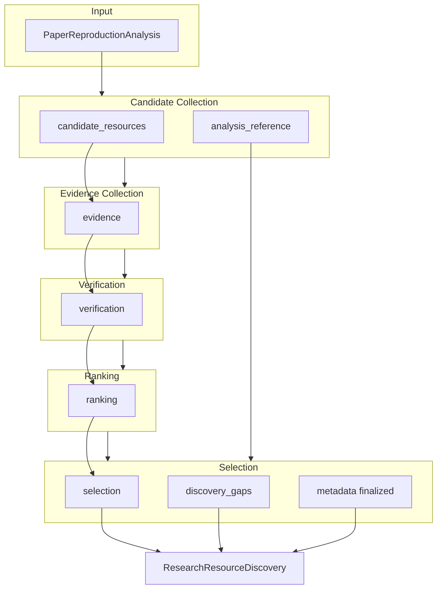

# Research Resource Discovery — Canonical Schema Design

**Project:** Man1Lab  
**Phase:** v1.2 — Research Resource Discovery Phase 1  
**Version:** Schema design draft  
**Status:** Design Only — no implementation  
**Audience:** Architects, schema implementers  
**Horizon:** 3–5 years  
**Last updated:** 2026-07-02

Related documents:

- [ADR-0013](../adr/ADR-0013-Research-Resource-Discovery.md) — architectural decision
- [research-resource-discovery.md](research-resource-discovery.md) — capability and pipeline design
- [ADR-0009](../adr/ADR-0009-Analysis-Canonical-Artifact.md) — `PaperReproductionAnalysis`
- [ARCHITECTURE.md](../architecture/ARCHITECTURE.md) — platform layers

This document defines the **canonical domain object** `ResearchResourceDiscovery` — the Discovery layer artifact equivalent to `PaperReproductionAnalysis` in Analysis. It specifies schema modules, field semantics, validation rules, pipeline mapping, and future provider alignment.

**Out of scope:** Python code, Pydantic models, runtime changes, workflow changes, API design, provider implementation.

---

## Executive Summary

`ResearchResourceDiscovery` is a **long-lived, evidence-traceable record** of how Man1Lab resolved external engineering resources for one paper reproduction run. It is produced once per Discovery invocation, consumed by Execution Planning (future), Review, and Reporting, and never mutates `PaperReproductionAnalysis`.

```text
ResearchResourceDiscovery
├── metadata
├── provenance
├── analysis_reference
├── candidate_resources
├── evidence
├── verification
├── ranking
├── selection
├── discovery_gaps
└── schema_version
```

Internal pipeline stages populate modules incrementally; the assembled object is the canonical output.

---

## 1. Current Problem

### 1.1 Why `PaperReproductionAnalysis` Alone Is Insufficient

`PaperReproductionAnalysis` ([ADR-0009](../adr/ADR-0009-Analysis-Canonical-Artifact.md)) answers paper-grounded questions:

| Module | Question |
|--------|----------|
| `metadata` | Which paper? |
| `goal` | What reproduction scope? |
| `resources` | What does the paper **state** about datasets, models, links? |
| `method` | What engineering approach does the paper describe? |
| `evaluation` | How does the paper claim to measure success? |
| `reproduction_gaps` | What does the paper **omit**? |

Analysis **records** gaps such as missing repository URL or unstated checkpoint. It does **not**:

- Search
- verify link liveness
- collect competing candidates
- attach evidence from external systems
- rank resources by officiality or scope fit
- select a primary resource for Execution Planning

When Execution Planning (or v1.1 Planner/Coder) receives only Analysis, it must **infer** external facts — violating Evidence over Guessing and producing high failure rates on benchmark papers with unresolved `repository`, `checkpoint`, and `dataset_link` gaps.

### 1.2 Why Discovery Requires Its Own Canonical Object

Discovery produces qualitatively different information from Analysis:

| Dimension | Analysis | Discovery |
|-----------|----------|-----------|
| **Source of truth** | Paper text | Paper seeds + external observation |
| **Mutability** | Fixed per paper interpretation | Per discovery run (re-runnable) |
| **Structure** | Goal / method / evaluation modules | Candidates / evidence / verification / ranking |
| **Time sensitivity** | Stable unless paper re-read | Links, repos, checkpoints change over time |
| **Audit need** | What paper said | Why this repo was chosen over alternatives |

Merging Discovery output into Analysis would:

1. **Break paper-first boundary** — external findings would appear as if stated by the paper
2. **Prevent re-discovery** — changing backends or rerunning search would require re-analysis
3. **Lose candidate history** — only winners would survive, destroying audit trail
4. **Couple layers** — Execution Planning could not consume discovery without re-parsing analysis

A separate **`ResearchResourceDiscovery`** artifact preserves layer independence, enables MLflow snapshotting of discovery runs, and gives Execution Planning a typed input for resource bindings without re-search.

---

## 2. Canonical Object

### 2.1 Top-Level Structure

**`ResearchResourceDiscovery`** — root object for one Discovery run.

| Module | Purpose |
|--------|---------|
| `metadata` | Identity and summary of this discovery run |
| `provenance` | How and when the artifact was produced |
| `analysis_reference` | Immutable link to input `PaperReproductionAnalysis` |
| `candidate_resources` | Complete candidate set (never truncated after selection) |
| `evidence` | Observable facts linked to candidates |
| `verification` | Verification outcomes per candidate |
| `ranking` | Ordered candidate lists per resource need |
| `selection` | Committed primary/fallback choices |
| `discovery_gaps` | Gaps remaining after Discovery (distinct from analysis gaps) |
| `schema_version` | Schema evolution identifier |

### 2.2 `metadata`

Run-level identity and high-level outcome. Does not duplicate analysis paper metadata.

| Field | Type (conceptual) | Description |
|-------|-------------------|-------------|
| `discovery_id` | opaque string | Unique ID for this discovery run (UUID or deterministic hash) |
| `created_at` | timestamp (ISO 8601) | When Discovery completed |
| `status` | enum | `complete`, `partial`, `failed`, `skipped` |
| `summary` | string | Human-readable one-line outcome (e.g. "Official repo selected; checkpoint unresolved") |
| `reproduction_scope` | enum (copied) | Snapshot of `goal.scope` from analysis at discovery time |
| `invocation_reason` | enum | Why Discovery ran: `gap_triggered`, `user_requested`, `policy_mandatory`, `manual_rerun` |
| `candidate_count` | integer | Total candidates collected |
| `selection_count` | integer | Number of primary selections made |
| `unresolved_gap_count` | integer | Count of `discovery_gaps` entries |

### 2.3 `provenance`

Traceability for reproducibility and debugging. Supports 3–5 year audit.

| Field | Type | Description |
|-------|------|-------------|
| `discovery_run_id` | string | Correlates with workflow / MLflow nested run |
| `pipeline_version` | string | Man1Lab version that produced this artifact |
| `stage_timestamps` | map | Stage name → completion timestamp |
| `providers_used` | list | Provider records (see §12) — name, version, invocation status |
| `degradation_notes` | list of strings | Backend failures, partial results, rate limits |
| `configuration_fingerprint` | string | Hash of discovery-relevant settings (thresholds, enabled tiers) — not full config dump |
| `rerun_of` | string \| null | Prior `discovery_id` if this is a rerun |

### 2.4 `analysis_reference`

Immutable binding to input analysis. Discovery never embeds a full copy of analysis modules (avoid drift); it references and snapshots key identifiers.

| Field | Type | Description |
|-------|------|-------------|
| `analysis_schema_version` | string | `PaperReproductionAnalysis.schema_version` at input time |
| `paper_title` | string | Denormalized for display / audit |
| `arxiv_id` | string | Denormalized; empty if absent |
| `source_path` | string \| null | Path to source PDF if available |
| `analysis_content_hash` | string | Hash of canonical analysis serialization — detects analysis change between runs |
| `analysis_gaps_addressed` | list | Gap categories Discovery attempted to resolve (`repository`, `checkpoint`, …) |
| `analysis_gaps_snapshot` | list | Copy of `reproduction_gaps` entries at discovery start — historical record only |

### 2.5 `candidate_resources`

The **complete** set of resource candidates. Selection does not remove entries.

| Field | Type | Description |
|-------|------|-------------|
| `candidates` | list of **Candidate** | All candidates (see §4) |
| `indexes` | map | Optional denormalized indexes: `by_resource_type`, `by_gap_category`, `by_provider` — for query efficiency in implementations |

### 2.6 `evidence`

All evidence records, centrally stored and referenced by ID.

| Field | Type | Description |
|-------|------|-------------|
| `records` | list of **EvidenceRecord** | Full evidence set (see §5) |
| `indexes` | map | `by_candidate_id` → list of evidence IDs |

Evidence is **append-only within a discovery run**. Contradictory evidence coexists; Ranking resolves conflicts.

### 2.7 `verification`

Verification outcomes per candidate. One record per candidate (latest if re-verified within same run).

| Field | Type | Description |
|-------|------|-------------|
| `records` | list of **VerificationRecord** | Per-candidate verification (see §6) |
| `indexes` | map | `by_candidate_id`, `by_status` |

### 2.8 `ranking`

Ranked orderings independent of verification pass/fail semantics (see §7).

| Field | Type | Description |
|-------|------|-------------|
| `rank_lists` | list of **RankList** | One list per **resource need** (see §7) |
| `global_notes` | string | Cross-list tie-breaking or scope notes |

**RankList** fields:

| Field | Type | Description |
|-------|------|-------------|
| `rank_list_id` | string | Unique within artifact |
| `resource_need` | **ResourceNeed** | What gap or role this list serves |
| `ordered_candidate_ids` | list of strings | Candidate IDs best-first |
| `scores` | map | candidate_id → **RankScore** |
| `ranking_factors_summary` | string | Human-readable rationale |
| `eligible_candidate_ids` | list | Subset that passed minimum verification for ranking |
| `created_at` | timestamp | When ranking completed |

### 2.9 `selection`

Committed choices for Execution Planning.

| Field | Type | Description |
|-------|------|-------------|
| `selections` | list of **SelectionRecord** | Primary/fallback per resource need (see §8) |
| `retained_candidate_policy` | string | Always `full_candidate_set_preserved` — documents invariant |
| `manual_overrides` | list | Future: user override records (empty in Phase 1) |

### 2.10 `discovery_gaps`

Gaps **after** Discovery — not the same as `reproduction_gaps` (see §9).

| Field | Type | Description |
|-------|------|-------------|
| `gaps` | list of **DiscoveryGap** | Unresolved or partially resolved resource needs |
| `analysis_gaps_closed` | list | Analysis gap categories successfully addressed by selection |
| `analysis_gaps_remaining` | list | Analysis gaps still open after Discovery |

### 2.11 `schema_version`

| Field | Type | Description |
|-------|------|-------------|
| `schema_version` | string | Discovery schema version (e.g. `"1.0"`) — independent of analysis schema version |

Future schema additions use optional modules or extension slots; breaking changes increment major version per platform convention.

### 2.12 Object Hierarchy Diagram

```text
ResearchResourceDiscovery
│
├── metadata ........................ run identity & outcome summary
├── provenance ...................... providers, timestamps, degradation
├── analysis_reference .............. input analysis binding (read-only link)
│
├── candidate_resources
│   └── candidates[] ............................. Candidate (§4)
│
├── evidence
│   └── records[]  ─................ EvidenceRecord (§5)
│
├── verification
│   └── records[]  ─................ VerificationRecord (§6)
│
├── ranking
│   └── rank_lists[]  ─............. RankList → RankScore (§7)
│
├── selection
│   └── selections[]  ─............. SelectionRecord (§8)
│
├── discovery_gaps
│   └── gaps[]  ─................... DiscoveryGap (§9)
│
└── schema_version
```

---

## 3. Resource Taxonomy

Every **Candidate** carries a `resource_type` from this taxonomy. Types are stable identifiers for 3–5 year evolution; new types append without redefining existing ones.

### 3.1 Tier 1 — Primary Reproduction Resources

| Resource type | Belongs in Discovery because |
|---------------|------------------------------|
| **official_repository** | Primary code home; Execution Planning anchors clone/run strategy here |
| **community_repository** | Alternative implementation; must be discovered, verified, and ranked against official |
| **project_page** | Paper homepage; seeds repo/data links; evidence for officiality |
| **checkpoint** | Weights required for training continuation or eval — external to paper PDF |
| **configuration** | Training/eval configs referenced or implied; often live outside paper |
| **documentation** | Official docs site, supplementary PDF hosting setup instructions |

### 3.2 Tier 2 — Distribution & Packaging Resources

| Resource type | Belongs in Discovery because |
|---------------|------------------------------|
| **dataset_portal** | Dataset hosting (Kaggle, UCI, OpenML, institutional) — download path resolution |
| **model_card** | Structured metadata linking model ↔ paper ↔ metrics (HF Model Card, etc.) |
| **huggingface_model** | Weight/tokenizer distribution on HuggingFace Hub |
| **huggingface_dataset** | Dataset distribution on HuggingFace Hub |
| **docker_image** | Prebuilt runtime; must be linked to paper/repo via evidence |
| **release_asset** | GitHub/GitLab release attachments (checkpoints, configs) |

### 3.3 Tier 3 — Future Resource Types (Reserved)

| Resource type | Notes |
|---------------|-------|
| **zenodo_record** | Archived artifacts with DOI |
| **figshare_dataset** | Research data publication |
| **papers_with_code_entry** | Benchmark / code index page |
| **pypi_package** | Pip-installable paper artifact |
| **conda_package** | Conda distribution |
| **colab_notebook** | Ephemeral demo — low trust for full reproduction |
| **institutional_mirror** | Region-specific dataset mirror |
| **custom** | Extension bucket with required `custom_type_label` |

Tier 3 types use the same Candidate / Evidence / Verification pipeline. Verification rules may be type-specific extensions without schema redesign.

### 3.4 Resource Need vs Resource Type

| Concept | Meaning |
|---------|---------|
| **Resource type** | What the candidate *is* (official_repository, checkpoint, …) |
| **Resource need** | What reproduction *requires* for a given analysis gap or role |

One resource need may accept multiple resource types (e.g. checkpoint need satisfied by `checkpoint`, `huggingface_model`, or `release_asset`). Rank lists are keyed by **resource need**, not only resource type.

**ResourceNeed** (conceptual):

| Field | Description |
|-------|-------------|
| `need_id` | Stable ID within artifact |
| `need_category` | Maps to analysis gap category or platform role: `code_repository`, `checkpoint`, `dataset`, `config`, `documentation`, `project_home`, `evaluation_asset` |
| `derived_from_analysis_gap` | bool — true if triggered by specific `reproduction_gaps` entry |
| `analysis_gap_index` | integer \| null — index into snapshotted analysis gaps |
| `required_for_scope` | list of reproduction scopes where this need is mandatory |
| `description` | Human-readable need statement |

---

## 4. Candidate Model

A **Candidate** is a *plausible external engineering resource* — unverified at collection time, enriched through later stages.

### 4.1 Candidate Fields

| Field | Type | Description |
|-------|------|-------------|
| `candidate_id` | string | **Unique** within `ResearchResourceDiscovery`; stable for all cross-references |
| `identity` | **ResourceIdentity** | Provider-native identifiers (see below) |
| `provider` | enum | Origin system: `paper_link`, `github`, `gitlab`, `huggingface`, `http`, `openalex`, `crossref`, `papers_with_code`, `manual`, `other` |
| `resource_type` | enum | From §3 taxonomy |
| `tier` | integer | 1, 2, or 3 |
| `url` | string | Canonical access URL (HTTPS preferred) |
| `title` | string | Display name (repo name, model ID, page title) |
| `officiality` | enum | `official`, `author_affiliated`, `community`, `third_party`, `unknown` |
| `paper_relation` | **PaperRelation** | How candidate relates to paper (see below) |
| `collection_source` | **CollectionSource** | How candidate entered the set |
| `status` | enum | Lifecycle: `collected`, `evidence_pending`, `evidence_complete`, `verified`, `ranked`, `selected_primary`, `selected_fallback`, `rejected`, `superseded` |
| `confidence` | float 0–1 | **Collection-time** plausibility only — not verification or ranking score |
| `related_candidate_ids` | list | Links (e.g. HF model → GitHub repo) |
| `addresses_needs` | list of need_id | Resource needs this candidate may satisfy |
| `notes` | string | Freeform collector notes |
| `collected_at` | timestamp | When Candidate Collection created this entry |
| `extensions` | map | Type-specific optional fields (future-proof) |

### 4.2 ResourceIdentity

Provider-neutral identity for deduplication across runs.

| Field | Description |
|-------|-------------|
| `provider` | Same as candidate provider |
| `provider_native_id` | e.g. `owner/repo`, HF model ID, DOI, arXiv ID of portal page |
| `normalized_url` | URL after canonicalization (strip tracking params, normalize host) |
| `content_hash` | Optional hash of fetched metadata snapshot |

Two candidates with same `normalized_url` or same `provider` + `provider_native_id` merge into one `candidate_id` during collection; merge provenance recorded in `collection_source`.

### 4.3 PaperRelation

| Field | Type | Description |
|-------|------|-------------|
| `relation_type` | enum | `cited_in_paper`, `same_authors`, `same_arxiv`, `same_title`, `linked_from_project_page`, `index_match`, `inferred`, `none` |
| `relation_strength` | enum | `explicit`, `strong`, `weak`, `speculative` |
| `matching_signals` | list of strings | e.g. `arxiv:2312.12345`, `author:Smith,J` |

### 4.4 CollectionSource

| Field | Type | Description |
|-------|------|-------------|
| `source_type` | enum | `analysis_external_resource`, `analysis_artifact`, `analysis_dataset_link`, `metadata_lookup`, `provider_search`, `provider_graph`, `cross_reference`, `manual` |
| `provider_name` | string \| null | Which Discovery provider produced this candidate |
| `source_query` | string \| null | Opaque query descriptor for audit (not raw API dump) |
| `seed_candidate_id` | string \| null | If expanded from another candidate (project page → repo) |

### 4.5 What a Candidate Is Not

- Not a selection decision
- Not verified merely by existing in the set
- Not guaranteed runnable
- Not invented — every candidate traces to paper seed or provider observation

---

## 5. Evidence Model

Evidence records **observable facts**. Evidence supports verification and ranking; it does **not** encode decisions.

### 5.1 EvidenceRecord Fields

| Field | Type | Description |
|-------|------|-------------|
| `evidence_id` | string | Unique within artifact |
| `candidate_id` | string | **Required** — exactly one candidate per evidence record |
| `evidence_type` | enum | Category of observation (see §5.2) |
| `evidence_source` | **EvidenceSource** | Where observation came from |
| `observed_fact` | **ObservedFact** | Structured fact payload |
| `polarity` | enum | `supports`, `refutes`, `neutral` |
| `confidence` | float 0–1 | Confidence in observation accuracy (not candidate suitability) |
| `collected_at` | timestamp | When fact was observed |
| `expires_at` | timestamp \| null | Optional freshness hint (link checks, star counts) |
| `raw_reference` | string \| null | Opaque pointer to raw capture (file path, API response ID) — not embedded blob |

### 5.2 Evidence Type Enum

| Type | Example observed fact |
|------|----------------------|
| `paper_citation_match` | README cites same arXiv ID |
| `title_match` | Resource title matches paper title |
| `author_match` | Repo owner matches paper author |
| `file_presence` | `train.py`, `requirements.txt` exists |
| `directory_structure` | `configs/`, `scripts/` present |
| `license_present` | LICENSE file detected |
| `license_type` | Apache-2.0 identified |
| `readme_claim` | README states "official implementation" |
| `commit_recency` | Last commit within N days |
| `star_count` | GitHub stars (weak signal) |
| `fork_of` | Identified as fork of another candidate |
| `model_card_field` | HF model card lists benchmark X |
| `http_status` | URL returned 200 |
| `redirect_chain` | Final URL after redirects |
| `metadata_extract` | OpenGraph / citation meta tags |
| `cross_reference` | Papers With Code links this repo |
| `other` | Extension with `custom_type_label` |

### 5.3 EvidenceSource

| Field | Description |
|-------|-------------|
| `source_kind` | `http_fetch`, `provider_api`, `paper_text`, `analysis_field`, `html_parse`, `llm_extract` |
| `provider_name` | Discovery provider if applicable |
| `uri` | Fetched URI |
| `fetch_status` | `success`, `partial`, `failed` |

LLM-derived evidence must be labeled `llm_extract` and never sole evidence for officiality selection.

### 5.4 ObservedFact

Structured, type-dependent payload — conceptual examples:

| evidence_type | observed_fact fields |
|---------------|---------------------|
| `paper_citation_match` | `matched_identifier`, `identifier_type`, `location_in_resource` |
| `file_presence` | `file_path`, `exists` |
| `license_type` | `spdx_id`, `file_path` |
| `commit_recency` | `last_commit_date`, `commit_count_12mo` |
| `http_status` | `status_code`, `final_url` |

Implementations may use a discriminated union pattern; schema design allows `extensions` for new fact shapes.

### 5.5 Evidence Invariants

- Evidence **never** references multiple candidates (many-to-one: many evidence → one candidate)
- Evidence **never** sets `selection` or `verification.status` directly
- Contradictory evidence for same candidate both persist (e.g. supports and refutes officiality)

---

## 6. Verification Model

Verification applies **reproducibility-relevant checks** to candidates using evidence. Shallow by design — no clone, no execute.

### 6.1 VerificationRecord Fields

| Field | Type | Description |
|-------|------|-------------|
| `verification_id` | string | Unique within artifact |
| `candidate_id` | string | One verification record per candidate per run |
| `status` | enum | `pass`, `partial`, `fail`, `skipped`, `error` |
| `dimensions` | list of **VerificationDimension** | Per-dimension outcomes |
| `blocking_failures` | list of strings | Human-readable blockers |
| `verified_at` | timestamp | When verification completed |
| `verifier_version` | string | Verification rule set version |

### 6.2 Verification Dimensions

Each dimension is evaluated independently; aggregate `status` derived by rule (see §10).

| Dimension | Question | Typical inputs |
|-----------|----------|----------------|
| **identity_match** | Does this resource plausibly belong to this paper (not homonym)? | author_match evidence, arxiv match, title similarity |
| **paper_match** | Does resource explicitly reference this paper/version? | citation in README, model card paper link |
| **framework_match** | Is stated framework compatible with `analysis.method.framework`? | requirements.txt, README framework mentions |
| **license** | Is license present and compatible with automated reproduction? | license_present, license_type evidence |
| **repository_health** | Is resource maintained / reachable? | http_status, commit_recency, archived flag |
| **artifact_availability** | Are implied artifacts present (train script, config, weights index)? | file_presence, release_asset evidence |
| **version_alignment** | Do versions align with paper era / stated dependencies? | tag dates, dependency pins vs analysis |
| **scope_alignment** | Does resource support `goal.scope` (training vs inference-only)? | README scope claims, file structure |

**VerificationDimension** fields:

| Field | Description |
|-------|-------------|
| `dimension` | Name from table above |
| `result` | `pass`, `partial`, `fail`, `not_applicable`, `insufficient_evidence` |
| `summary` | Short explanation |
| `evidence_ids` | Evidence records supporting this dimension result |
| `details` | map — dimension-specific (e.g. detected license, missing files list) |

### 6.3 Aggregate Status Rules (Conceptual)

| status | Meaning |
|--------|---------|
| `pass` | All mandatory dimensions pass for candidate's resource type |
| `partial` | Reachable and identity plausible but structural gaps (e.g. no train script for TRAINING scope) |
| `fail` | Identity mismatch, unreachable, or license block |
| `skipped` | Resource type excluded from verification policy |
| `error` | Verifier could not complete (treat as fail for selection eligibility) |

Verification **does not rank** candidates — two candidates may both `pass` with different suitability.

---

## 7. Ranking Model

Ranking orders candidates **within a resource need**. Ranking is independent from verification: verification gates eligibility; ranking orders eligible (and optionally partial) candidates.

### 7.1 Why Verification ≠ Ranking

| Verification | Ranking |
|--------------|---------|
| Binary / ternary suitability gates | Relative ordering |
| Rule-based on evidence dimensions | Weighted multi-factor comparison |
| Same pass status for unequal candidates | Differentiates among passes |
| Answers: "Is this acceptable?" | Answers: "Which is best?" |

Example: three repos may all `pass` identity and reachability; ranking orders by officiality and paper citation strength.

### 7.2 RankScore Fields

| Field | Type | Description |
|-------|------|-------------|
| `candidate_id` | string | Ranked candidate |
| `total_score` | float | Weighted composite (implementation-defined weights, recorded in provenance) |
| `factor_scores` | map | Factor name → numeric contribution |
| `ranking_factors` | list of **RankingFactor** | Explainable breakdown |

### 7.3 Ranking Factors (Suggested)

| Factor | Weight guidance | Source |
|--------|-----------------|--------|
| `officiality` | High | candidate.officiality + evidence |
| `paper_relation_strength` | High | paper_relation, citation evidence |
| `verification_status` | High | pass > partial > fail |
| `scope_fit` | Medium | scope_alignment dimension |
| `artifact_completeness` | Medium | artifact_availability dimension |
| `maintenance_signal` | Low (tie-break) | repository_health |
| `community_adoption` | Low (tie-break) | star_count — never dominant |
| `tier_preference` | Medium | Tier 1 before Tier 2 for same need |
| `provider_trust` | Low | paper_link seed before inferred search |

### 7.4 Tie-Breaking

When `total_score` equal within epsilon:

1. Higher `officiality` ordinal
2. Stronger `paper_relation.relation_strength`
3. `paper_link` collection source over provider search
4. Lexicographic `candidate_id` (deterministic)

Tie-breaking rules recorded in `rank_list.ranking_factors_summary`.

### 7.5 Selection Eligibility

Candidates eligible for ranking inclusion:

| verification.status | Eligible? |
|---------------------|-----------|
| `pass` | Yes |
| `partial` | Yes, with flag in rank score |
| `fail` | No — excluded from `eligible_candidate_ids` unless policy override |
| `error` | No |

Ranking **may** produce empty `ordered_candidate_ids` — valid output triggering `discovery_gaps`.

---

## 8. Selection Model

Selection **commits** resources Execution Planning consumes. It does not delete candidates.

### 8.1 SelectionRecord Fields

| Field | Type | Description |
|-------|------|-------------|
| `selection_id` | string | Unique within artifact |
| `resource_need` | **ResourceNeed** | Which need this selection addresses |
| `primary_candidate_id` | string \| null | Top ranked eligible candidate |
| `fallback_candidate_ids` | list | Ordered alternates |
| `selection_reason` | **SelectionReason** | Structured justification |
| `confidence` | float 0–1 | Selection confidence (distinct from candidate collection confidence) |
| `selected_at` | timestamp | When selection committed |
| `rank_list_id` | string | Source rank list reference |
| `verification_snapshot` | map | candidate_id → status at selection time |

### 8.2 SelectionReason

| Field | Description |
|-------|-------------|
| `summary` | Human-readable one paragraph |
| `deciding_factors` | list of factor names that determined primary |
| `evidence_ids` | Key evidence supporting selection |
| `rejected_candidate_ids` | Notable rejected candidates with brief reason code |
| `policy_applied` | e.g. `prefer_official`, `paper_link_wins`, `scope_training_required` |

### 8.3 Primary vs Fallback

| Role | Rule |
|------|------|
| **Primary** | Highest-ranked eligible candidate; null if none eligible |
| **Fallback** | Next N eligible candidates; used when Execution Planning or Execution fails downstream |

Fallbacks are **not** second-class deletes — they remain in `candidate_resources` with status updated.

### 8.4 Retained Candidates

**Invariant:** `candidate_resources.candidates` length is unchanged after Selection. Status fields update (`selected_primary`, `selected_fallback`, `rejected`); no removal.

| Why retain | Benefit |
|------------|---------|
| Audit | Prove why alternative was not chosen |
| Rerun | Re-rank without re-collection |
| Human review | Override without re-discovery |
| ML training | Future learning from discovery decisions |

### 8.5 Manual Override (Future)

Reserved structure in `selection.manual_overrides`:

| Field | Description |
|-------|-------------|
| `override_id` | Unique |
| `resource_need_id` | Which need overridden |
| `previous_primary_id` | System choice |
| `override_candidate_id` | User choice |
| `reason` | User-provided |
| `overridden_at` | Timestamp |

Phase 1 schema includes empty list; Execution Planning must respect overrides when present.

---

## 9. Gap Model

### 9.1 Analysis `reproduction_gaps` vs Discovery `discovery_gaps`

| Aspect | Analysis `reproduction_gaps` | Discovery `discovery_gaps` |
|--------|------------------------------|----------------------------|
| **Producer** | Reader / Analysis layer | Discovery layer |
| **Meaning** | Paper **omitted** this information | Discovery **could not resolve** resource after search |
| **Timing** | Before any external search | After full Discovery pipeline |
| **Example** | "Paper does not provide repository URL" | "No verified official repository found" |
| **Consumer** | Discovery (input triggers) | Execution Planning, Report |

Analysis gaps **drive** Discovery effort; Discovery gaps **report** outcome.

### 9.2 DiscoveryGap Fields

| Field | Type | Description |
|-------|------|-------------|
| `gap_id` | string | Unique within artifact |
| `gap_type` | enum | See §9.3 |
| `severity` | enum | `blocking`, `degraded`, `informational` |
| `resource_need_id` | string \| null | Related need if applicable |
| `description` | string | Human-readable statement |
| `related_analysis_gap_index` | integer \| null | Link to snapshotted analysis gap |
| `candidate_ids_examined` | list | Candidates that were considered |
| `recommended_action` | enum | `generate_from_scratch`, `manual_input`, `narrow_scope`, `retry_discovery`, `abort`, `proceed_with_partial` |
| `details` | map | Type-specific (e.g. archived repo URL, framework mismatch pair) |

### 9.3 Discovery Gap Types

| gap_type | Meaning |
|----------|---------|
| `no_official_repository` | No candidate passes officiality + verification bar |
| `no_viable_repository` | No repo passes minimum verification |
| `checkpoint_missing` | No verified checkpoint / weights resource |
| `config_missing` | No config resource for stated method |
| `dataset_unavailable` | Dataset portal unreachable or unverified |
| `repository_archived` | Best candidate is archived/read-only |
| `framework_mismatch` | Best repo fails framework_match for required scope |
| `license_blocked` | Best candidate fails license dimension |
| `scope_insufficient` | Resource supports inference only; scope requires training |
| `provider_unavailable` | Could not search due to backend failure |
| `ambiguous_multiple_official` | Multiple indistinguishable official candidates — human review |
| `paper_link_dead` | Paper-stated URL failed with no verified alternative |
| `other` | Extension gap |

### 9.4 Gap Closure Tracking

| Field | Description |
|-------|-------------|
| `analysis_gaps_closed` | Analysis gap categories where selection succeeded |
| `analysis_gaps_remaining` | Analysis categories still open (Discovery attempted but failed, or not attempted) |

Closure is **category-level** — partial checkpoint resolution may close `checkpoint` analysis gap even if quality is degraded (record severity in discovery gap if needed).

---

## 10. Validation Rules

Conceptual rules for implementers. No runtime code in this phase.

### 10.1 Identity and Referential Integrity

| Rule | Description |
|------|-------------|
| **V-01** | Every `candidate_id` is unique within the artifact |
| **V-02** | Every `evidence.candidate_id` references an existing candidate |
| **V-03** | Every `verification.candidate_id` references an existing candidate |
| **V-04** | Every ID in `rank_list.ordered_candidate_ids` references an existing candidate |
| **V-05** | Every `selection.primary_candidate_id` and fallback ID references an existing candidate |
| **V-06** | Every `selection.rank_list_id` references an existing rank list |
| **V-07** | Every `evidence_id` referenced in verification or selection exists in `evidence.records` |

### 10.2 Semantic Rules

| Rule | Description |
|------|-------------|
| **V-10** | Discovery never invents resources — every candidate has non-empty `collection_source` |
| **V-11** | Every selection primary/fallback references a candidate with verification `pass` or `partial` (never `fail`) |
| **V-12** | Ranking lists exclude unknown candidate IDs (V-04) |
| **V-13** | `partial` selections must record limitation in `selection_reason` |
| **V-14** | Evidence does not reference selection or rank_list IDs (one-directional flow) |
| **V-15** | `analysis_content_hash` must correspond to input analysis used for run (workflow responsibility) |
| **V-16** | Candidate count in metadata matches `len(candidate_resources.candidates)` |
| **V-17** | No candidate removed after collection — candidate set size monotonic |

### 10.3 Stage Ordering

| Rule | Description |
|------|-------------|
| **V-20** | Evidence records must not exist without corresponding candidate |
| **V-21** | Verification records should not precede at least one evidence record for that candidate (except `insufficient_evidence` outcomes) |
| **V-22** | Rank lists must not precede verification records for ranked candidates |
| **V-23** | Selection must not precede rank list for same resource need |

Violations indicate pipeline bug, not user error.

### 10.4 Extensibility

| Rule | Description |
|------|-------------|
| **V-30** | Unknown `resource_type` or `gap_type` with `extensions` validates if required extension fields present |
| **V-31** | New evidence types require `evidence_type=other` + `custom_type_label` until schema minor bump |

---

## 11. Pipeline Mapping

Which Discovery stage produces which schema module.

```text
Candidate Collection  →  candidate_resources (+ partial metadata, provenance)
Evidence Collection   →  evidence (+ candidate.status updates)
Verification          →  verification (+ candidate.status updates)
Ranking               →  ranking
Selection             →  selection, discovery_gaps, metadata (final counts/status)
Assembly              →  analysis_reference, schema_version, provenance (finalized)
```

### 11.1 Stage → Module Matrix

| Stage | Creates | Updates | Does not touch |
|-------|---------|---------|----------------|
| **Candidate Collection** | `candidate_resources.candidates`, initial `provenance.providers_used`, `analysis_reference` snapshot | `metadata.candidate_count`, `metadata.status=partial` | `evidence`, `verification`, `ranking`, `selection` |
| **Evidence Collection** | `evidence.records` | `candidate.status` → evidence_complete; `provenance.stage_timestamps` | `ranking`, `selection` |
| **Verification** | `verification.records` | `candidate.status` → verified; dimension-level detail | `selection` |
| **Ranking** | `ranking.rank_lists` | `candidate.status` → ranked | `selection`, `discovery_gaps` |
| **Selection** | `selection.selections`, `discovery_gaps.gaps`, closure lists | `candidate.status` → selected_* / rejected; `metadata.selection_count`, `metadata.unresolved_gap_count`, `metadata.status=complete` | Does not delete candidates or evidence |
| **Assembly / finalize** | `schema_version` | `metadata.created_at`, `provenance` completeness | — |

### 11.2 Partial Run Semantics

If Discovery stops early (provider failure, policy abort):

| Last completed stage | Artifact status | Required modules |
|---------------------|-----------------|------------------|
| Candidate Collection | `partial` | candidates, analysis_reference, provenance |
| Evidence Collection | `partial` | + evidence |
| Verification | `partial` | + verification |
| Ranking | `partial` | + ranking; discovery_gaps may list `provider_unavailable` |
| Selection | `complete` or `partial` | Full schema; gaps document unresolved needs |

Partial artifacts are **valid** canonical objects — Execution Planning must check `metadata.status`.

### 11.3 Data Flow Diagram



---

## 12. Future Provider Mapping

Providers populate the **same canonical schema**. No provider-specific top-level objects.

### 12.1 Provider → Schema Mapping

| Provider (future) | Populates | Typical evidence types |
|-------------------|-----------|------------------------|
| **Paper link seed** | `candidate_resources` from analysis URLs | `http_status`, `redirect_chain` |
| **GitHub REST / Search** | candidates `provider=github` | `file_presence`, `commit_recency`, `license_type` |
| **GitHub GraphQL** | same + richer metadata | `author_match`, `fork_of` |
| **OpenAlex** | candidates + `cross_reference` evidence | `metadata_extract`, `paper_citation_match` |
| **CrossRef** | DOI / publication links → project pages | `metadata_extract`, `title_match` |
| **Papers with Code** | `papers_with_code_entry`, linked repos | `cross_reference`, `paper_citation_match` |
| **HuggingFace Hub** | `huggingface_model`, `huggingface_dataset`, `model_card` | `model_card_field`, `paper_match` |
| **HTTP fetch (generic)** | evidence for any URL candidate | `http_status`, `readme_claim`, `file_presence` |

### 12.2 Provider Provenance Record

Each entry in `provenance.providers_used`:

| Field | Description |
|-------|-------------|
| `provider_name` | e.g. `github_search`, `openalex`, `paper_seed` |
| `provider_version` | Adapter version |
| `invoked_at` | Timestamp |
| `status` | `success`, `partial`, `failed`, `skipped` |
| `candidates_contributed` | Count |
| `evidence_contributed` | Count |
| `error_summary` | null or string |

### 12.3 Normalization Responsibility

Providers **normalize outward** into Candidate / Evidence — they do not leak raw API shapes into the canonical object. Raw captures optionally referenced via `evidence.raw_reference` for debug only.

### 12.4 Same Schema, Multiple Providers

One Discovery run may merge candidates from GitHub + HuggingFace + paper seeds. Deduplication via `ResourceIdentity.normalized_url` and `provider_native_id`. Conflicts become evidence, not duplicate candidates.

---

## 13. Evolution and Versioning

### 13.1 Schema Version Policy

| Change type | Version bump |
|-------------|--------------|
| New optional field | Patch (1.0 → 1.1) |
| New resource_type / evidence_type enum value | Minor |
| Breaking field rename or semantic change | Major |

### 13.2 Extension Points

| Location | Purpose |
|----------|---------|
| `candidate.extensions` | Provider-specific non-canonical fields |
| `observed_fact.extensions` | New evidence payloads |
| `discovery_gaps.details` | Gap-specific structured data |
| `resource_type=custom` | Tier 3 resources before first-class enum |

### 13.3 Long-Term Stability

Modules (`evidence`, `verification`, `ranking`, `selection`) remain separable so Execution Planning can depend on `selection` without parsing evidence chains. Full artifact retention supports 3–5 year reproduction audits and benchmark comparisons.

---

## 14. Implementation Handoff

The next phase translates this document into:

1. Pydantic (or equivalent) models mirroring §2 hierarchy
2. Validation enforcing §10 rules
3. Discovery pipeline stages writing modules incrementally
4. Snapshot serialization to workflow history and MLflow artifacts

Implementers should **not** revisit architecture decisions captured in [ADR-0013](../adr/ADR-0013-Research-Resource-Discovery.md) and [research-resource-discovery.md](research-resource-discovery.md) unless schema validation reveals a gap — in which case update this document first.

---

## Document Maintenance

| Event | Action |
|-------|--------|
| Schema implementation starts | Mark ADR-0013 Accepted; pin `schema_version` |
| New resource type added | Update §3; minor schema bump |
| New provider adopted | Update §12; infrastructure ADR |
| Execution Planning schema designed | Cross-link companion document |

**Status:** Design Only — Phase 1 schema complete. No code, runtime, workflow, or provider changes.
