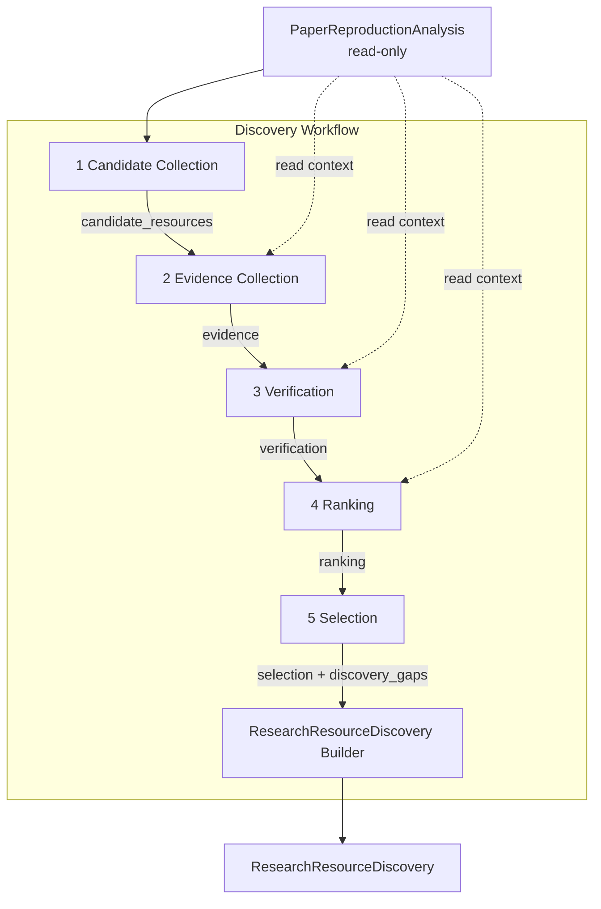

# Research Resource Discovery — Workflow Architecture

**Project:** Man1Lab  
**Phase:** v1.2 — Research Resource Discovery  
**Version:** Workflow design draft (refinement pass)  
**Status:** Design Only — implementation-ready specification  
**Audience:** Architects, workflow implementers  
**Horizon:** 3–5 years  
**Last updated:** 2026-07-02

Related documents:

- [ADR-0013](../adr/ADR-0013-Research-Resource-Discovery.md) — capability boundary and ADR decision
- [research-resource-discovery.md](research-resource-discovery.md) — capability design
- [research-resource-discovery-schema.md](research-resource-discovery-schema.md) — canonical object schema
- [ADR-0012](../adr/ADR-0012-Experiment-Tracking-MLflow.md) — experiment tracking port pattern

This document describes **how the Discovery pipeline runs** — stage order, data flow, invariants, error recovery, provider interaction, and tracking hooks. It does **not** redefine the `ResearchResourceDiscovery` schema (see schema document) and does **not** specify APIs, classes, or provider SDKs.

**Out of scope:** Python code, Pydantic models, schema changes, ADR changes, prompts, runtime changes.

---

## 1. Purpose

### 1.1 Why Discovery Needs an Independent Workflow

Research Resource Discovery is not a single function call or a search query. It is a **multi-stage, append-only resolution process** that transforms paper-grounded analysis into an evidence-backed resource artifact.

An independent **Discovery Workflow** is required because:

| Reason | Explanation |
|--------|-------------|
| **Stage separation** | Collection, evidence, verification, ranking, and selection have different inputs, failure modes, and provider dependencies |
| **Auditability** | Each stage produces inspectable intermediate state mapped to canonical schema modules |
| **Partial completion** | Backends fail independently; the workflow must emit partial artifacts rather than abort |
| **Layer boundary** | Discovery logic must not leak into Analysis, Execution Planning, or Execution |
| **Provider replaceability** | Workflow orchestrates ports; adapters change without reordering stages |

The workflow is **internal to the Discovery layer**. The platform workflow coordinator invokes Discovery as one logical step; Discovery coordinator runs the five fixed stages internally.

### 1.2 Position Relative to Adjacent Layers

| Layer | Role relative to Discovery |
|-------|---------------------------|
| **Analysis** | Produces read-only input `PaperReproductionAnalysis`. Discovery never writes back. |
| **Discovery Workflow** | Consumes analysis; runs five stages; emits `ResearchResourceDiscovery`. |
| **Execution Planning** (future) | Consumes analysis + discovery artifact; decides reproduction strategy. Must not re-run Discovery. |
| **Execution** | Clone, install, run. Occurs only after planning commits to a strategy. |

Discovery Workflow **ends** when `ResearchResourceDiscovery` is assembled — including partial status. It does not clone, execute, or plan engineering tasks.

### 1.3 Platform Pipeline

```text
Paper (PDF)
    ↓
Parsing
    ↓
Analysis
    ↓
PaperReproductionAnalysis          ← read-only input to Discovery
    ↓
Discovery Workflow                 ← this document
    ↓
ResearchResourceDiscovery          ← canonical Discovery output
    ↓
Execution Planning                 ← future
    ↓
Execution
    ↓
Verification → Review → Report
```

### 1.4 What This Document Answers

| Question | Answered here |
|----------|---------------|
| In what order do Discovery stages run? | Yes |
| What does each stage read and write? | Yes |
| How does the workflow handle failures? | Yes |
| How do runtime stage objects flow? | Yes (§4) |
| What is Discovery execution lifecycle? | Yes (§5) |
| How do providers plug in? | Yes (§9) |
| What fields exist on `Candidate`? | No — see [schema doc](research-resource-discovery-schema.md) |

## 2. Discovery Stage Overview

Discovery executes **exactly five stages** in **fixed order**. This order is normative for all implementations.

```text
Candidate Collection
        ↓
Evidence Collection
        ↓
Verification
        ↓
Ranking
        ↓
Selection
        ↓
ResearchResourceDiscovery Builder
        ↓
ResearchResourceDiscovery
```

### 2.1 Execution Rules

| Rule | Meaning |
|------|---------|
| **Fixed order** | Stages always run 1 → 2 → 3 → 4 → 5. No stage runs before its predecessor completes (success or controlled partial). |
| **No skipping** | Even when Candidate Collection returns zero candidates, later stages still run (producing empty modules and discovery gaps). |
| **No cross-stage mutation** | A stage writes only its designated schema modules. It does not rewrite prior stage outputs. |
| **Append-only enrichment** | Later stages add information (evidence, verification, ranks, selections). They do not delete candidates. |
| **Analysis immutability** | `PaperReproductionAnalysis` is read-only for the entire workflow. |

### 2.2 Workflow Coordinator vs Platform Coordinator

| Coordinator | Scope |
|-------------|-------|
| **Platform workflow coordinator** | Decides whether to invoke Discovery (gap triggers, user flag); passes analysis in, receives artifact out |
| **Discovery workflow coordinator** | Runs five internal stages; maintains in-progress artifact builder; invokes provider ports per stage |

Discovery workflow coordinator is **native Man1Lab logic**. It imports no vendor SDKs.

### 2.3 ResearchResourceDiscovery Builder (Assembly)

Assembly is **not** a sixth semantic stage. It does not collect, verify, rank, or select resources. It is the **ResearchResourceDiscovery Builder** — a finalization step that converts accumulated stage outputs into the canonical artifact.

```text
SelectionResult (runtime)
        ↓
ResearchResourceDiscovery Builder   ← NOT a semantic stage
        ↓
ResearchResourceDiscovery (canonical — exits Discovery layer)
```

#### What Assembly is

| Property | Detail |
|----------|--------|
| **Role** | Artifact construction and validation only |
| **Input** | Accumulated runtime stage results + in-progress builder state |
| **Output** | Immutable `ResearchResourceDiscovery` ready for downstream layers |
| **Business logic** | None — no resource decisions, no provider calls |

#### Builder responsibilities (only)

| Responsibility | Maps to schema module |
|----------------|----------------------|
| Set `schema_version` | Root |
| Finalize `metadata` | `discovery_id`, `created_at`, `status`, `summary`, counts |
| Compute statistics | `candidate_count`, `selection_count`, `unresolved_gap_count` |
| Finalize `provenance` | `stage_timestamps`, complete `providers_used`, `degradation_notes` |
| Bind analysis | Complete `analysis_reference` (hash, gap snapshot, gaps addressed) |
| Run conceptual validation | Schema rules V-01–V-31 (see schema doc) — fail-soft → `metadata.status=partial` |
| Serialize | Emit canonical artifact snapshot |

#### What Assembly must never do

| Forbidden | Reason |
|-----------|--------|
| Invoke Collection / Evidence / Verification providers | Provider scope ends at Stage 5 |
| Re-rank or re-select | Selection is final when Builder starts |
| Modify `candidate_resources` count | Append-only invariant |
| Add or remove evidence / verification records | Stage purity |
| Modify `PaperReproductionAnalysis` | Layer boundary |
| Infer missing URLs or candidates | Business logic belongs in stages 1–5 |

#### Builder vs semantic stages

| Semantic stage (1–5) | Builder (Assembly) |
|------------------------|-------------------|
| Resolves resources | Packages resolution outcome |
| May call provider ports | Calls no providers |
| Produces runtime stage result | Produces canonical artifact |
| May leave modules incomplete mid-run | Requires all modules present (possibly empty lists) |

Assembly runs **once**, immediately after Stage 5 completes. If validation warnings occur, Builder still emits artifact with `metadata.status=partial` and notes in `provenance`.

---

## 3. Stage Specifications

Each subsection follows: Purpose → Inputs → Outputs → Responsibilities → Non-responsibilities → Failure handling → Stage transition.

Schema module names align with [research-resource-discovery-schema.md](research-resource-discovery-schema.md).

---

### 3.1 Stage 1 — Candidate Collection

#### Purpose

Enumerate **plausible external engineering resources** for each resource need implied by analysis — without judging quality, reachability, or suitability.

#### Inputs

| Input | Source |
|-------|--------|
| `PaperReproductionAnalysis` | Analysis layer (read-only) |
| Resource needs (derived) | Computed from `reproduction_gaps`, `resources`, `goal.scope` |
| Discovery configuration | Enabled collection providers, tier policy (via settings port — not imported in workflow logic) |

#### Outputs

| Output | Schema module |
|--------|---------------|
| Candidate set | `candidate_resources.candidates` |
| Analysis binding snapshot | `analysis_reference` (initial) |
| Provider invocation records | `provenance.providers_used` (partial) |
| Run metadata (partial) | `metadata` (`candidate_count`, `status=partial`) |

#### Responsibilities

- Invoke **Collection Providers** (ports) in configured order
- Seed candidates from paper-stated URLs in analysis `resources` and `external_resources`
- Expand candidates from metadata signals (title, authors, arXiv ID) via index providers
- Assign `candidate_id`, `ResourceIdentity`, `resource_type`, `tier`, `collection_source`
- **Deduplicate** by normalized URL and provider-native ID; merge provenance when duplicates found
- Map candidates to **resource needs** (`addresses_needs`)
- Record which analysis gap categories Discovery attempted to address
- Never invent URLs — every candidate traces to paper seed or provider observation

#### Non-responsibilities

- Fetching detailed evidence (README parsing, file trees) — Evidence Collection
- Reachability or identity verification — Verification
- Ordering candidates — Ranking
- Choosing primary resource — Selection
- Modifying analysis — forbidden
- Clone, download, execute — Execution layer

#### Failure handling

| Condition | Workflow behavior |
|-----------|-------------------|
| **Provider unavailable** | Log in `provenance.degradation_notes`; continue with next provider; do not abort workflow |
| **Rate limit / timeout** | Observe `Timeout` / `ProviderUnavailable` from port; record degradation; continue with next provider (retry is adapter responsibility — see §8.4) |
| **Zero candidates for a need** | Valid output; record need for later `discovery_gaps`; proceed to Stage 2 |
| **Duplicate URLs across providers** | Merge into one candidate; preserve all `collection_source` records |
| **All providers fail** | Emit empty `candidate_resources`; set degradation notes; **continue** to Evidence Collection |
| **Invalid analysis input** | Fail workflow before Stage 1 (platform responsibility — malformed analysis is not a Discovery partial case) |

#### Stage transition

**Exit criteria:** Candidate set finalized (possibly empty); `analysis_reference` snapshotted; provenance updated.

**Next stage:** Evidence Collection — always invoked.

---

### 3.2 Stage 2 — Evidence Collection

#### Purpose

Gather **observable facts** about each candidate that support or refute its suitability — without making selection decisions.

#### Inputs

| Input | Source |
|-------|--------|
| `candidate_resources.candidates` | Stage 1 output |
| `PaperReproductionAnalysis` | Read-only context for match comparisons |
| Candidate list | All candidates — including those from failed provider expansions |

#### Outputs

| Output | Schema module |
|--------|---------------|
| Evidence records | `evidence.records` |
| Candidate status updates | `candidate_resources` (`status` → `evidence_complete` or `evidence_pending`) |
| Provider records | `provenance.providers_used`, `provenance.stage_timestamps` |

#### Responsibilities

- Invoke **Evidence Providers** per candidate or batched by provider capability
- Produce `EvidenceRecord` entries: type, source, observed fact, polarity, confidence, timestamp
- Link every evidence record to exactly one `candidate_id`
- Record contradictory evidence — both persist; no resolution in this stage
- Mark candidates with incomplete evidence when fetch fails — candidate still proceeds

#### Non-responsibilities

- Aggregate evidence into pass/fail — Verification
- Score or rank candidates — Ranking
- Select resources — Selection
- Modify or remove candidates — forbidden
- LLM inference as sole evidence for officiality (if used, label source; verification must not rely on LLM-only evidence for hard gates)

#### Failure handling

| Condition | Workflow behavior |
|-----------|-------------------|
| **Network failure for one candidate** | Record failed fetch in evidence source; candidate proceeds with `insufficient_evidence` path in Verification |
| **Evidence provider unavailable** | Degradation note; skip provider; continue with remaining providers |
| **Zero evidence for all candidates** | Valid; Verification runs with `insufficient_evidence` dimensions |
| **Partial page fetch** | Store partial evidence; flag fetch status in evidence source |

#### Stage transition

**Exit criteria:** Evidence collection pass complete for all candidates (each has ≥0 evidence records).

**Next stage:** Verification — always invoked.

---

### 3.3 Stage 3 — Verification

#### Purpose

Apply **reproducibility-relevant checks** to each candidate using collected evidence — shallow validation without clone or execute.

#### Inputs

| Input | Source |
|-------|--------|
| `candidate_resources.candidates` | Stage 1 |
| `evidence.records` | Stage 2 |
| `PaperReproductionAnalysis` | Scope, framework, goal for alignment checks |

#### Outputs

| Output | Schema module |
|--------|---------------|
| Verification records | `verification.records` (one per candidate) |
| Candidate status updates | `status` → `verified` |
| Dimension-level results | Embedded in verification records |

#### Responsibilities

- Invoke **Verification Provider** (native rules engine and/or port adapters)
- Evaluate dimensions: identity_match, paper_match, framework_match, license, repository_health, artifact_availability, version_alignment, scope_alignment
- Assign aggregate status: `pass`, `partial`, `fail`, `skipped`, `error`
- Reference `evidence_ids` supporting each dimension result
- Determine **selection eligibility** flag used by Ranking (pass/partial eligible; fail excluded by default)

#### Non-responsibilities

- Relative ordering among candidates — Ranking
- Primary/fallback commitment — Selection
- Deep clone or compile checks — Execution
- Removing failed candidates from artifact — forbidden
- Rewriting evidence — forbidden

#### Failure handling

| Condition | Workflow behavior |
|-----------|-------------------|
| **All candidates fail verification** | Valid; Ranking produces empty eligible sets; Selection records `discovery_gaps` |
| **Partial pass** | Record limitations in dimension details; candidate remains eligible with flag |
| **Verifier error for one candidate** | Status `error`; treat as fail for eligibility; continue other candidates |
| **No evidence for candidate** | Dimensions → `insufficient_evidence`; aggregate likely `partial` or `fail` |
| **Verification provider unavailable** | Degradation note; apply minimal native rules (e.g. reachability only) if policy allows; else mark dimensions `insufficient_evidence` |

#### Stage transition

**Exit criteria:** Every candidate has a verification record.

**Next stage:** Ranking — always invoked.

---

### 3.4 Stage 4 — Ranking

#### Purpose

**Order** candidates within each resource need by reproduction suitability — independent of verification except for eligibility gating.

#### Inputs

| Input | Source |
|-------|--------|
| `candidate_resources.candidates` | Stage 1 |
| `verification.records` | Stage 3 |
| `evidence.records` | Stage 2 (read-only for factor scoring) |
| `PaperReproductionAnalysis` | Scope and method for scope_fit factors |
| Resource needs | From analysis-derived need list |

#### Outputs

| Output | Schema module |
|--------|---------------|
| Rank lists | `ranking.rank_lists` (one per resource need) |
| Rank scores | Embedded in rank lists |
| Candidate status updates | `status` → `ranked` |
| Eligible candidate IDs | Per rank list |

#### Responsibilities

- Build one **RankList** per resource need
- Exclude ineligible candidates (`verification.status` = fail/error) from `eligible_candidate_ids` unless policy override
- Compute weighted factor scores (officiality, paper relation, verification status, scope fit, tier preference)
- Apply deterministic tie-breaking
- Produce empty rank list when no eligible candidates — valid output

#### Non-responsibilities

- Verification dimension evaluation — already complete
- Evidence collection — forbidden to add evidence in Ranking
- Committing selection — Selection
- Deleting low-ranked candidates — forbidden
- Modifying verification records — forbidden

#### Failure handling

| Condition | Workflow behavior |
|-----------|-------------------|
| **Ranking empty for a need** | Valid; empty `ordered_candidate_ids`; Selection will create `discovery_gap` |
| **Single eligible candidate** | Rank list of length 1 |
| **All candidates partial** | Rank by factor scores; note limitations in `ranking_factors_summary` |
| **Ranking engine error** | Degradation note; produce empty rank list for affected need; continue |

#### Stage transition

**Exit criteria:** All resource needs have a rank list (possibly empty).

**Next stage:** Selection — always invoked.

---

### 3.5 Stage 5 — Selection

#### Purpose

**Commit** primary and fallback resource choices per resource need for Execution Planning consumption.

#### Inputs

| Input | Source |
|-------|--------|
| `ranking.rank_lists` | Stage 4 |
| `verification.records` | Stage 3 (snapshot at selection time) |
| `candidate_resources.candidates` | Stage 1 (full set retained) |
| Key `evidence.records` | For selection_reason references |

#### Outputs

| Output | Schema module |
|--------|---------------|
| Selection records | `selection.selections` |
| Discovery gaps | `discovery_gaps.gaps` |
| Gap closure tracking | `discovery_gaps.analysis_gaps_closed`, `analysis_gaps_remaining` |
| Candidate status updates | `selected_primary`, `selected_fallback`, `rejected` |
| Final metadata | `metadata.status`, `selection_count`, `unresolved_gap_count`, `summary` |

#### Responsibilities

- Select **primary** candidate (top eligible ranked) per resource need, or null if none
- Select ordered **fallbacks** from remaining eligible candidates
- Write **selection_reason** with deciding factors and evidence references
- Record **discovery_gaps** for unresolved needs (distinct from analysis gaps)
- Update candidate status fields — **never remove candidates**
- Set `metadata.status` to `complete` or `partial` based on gap severity

#### Non-responsibilities

- Re-ranking — forbidden unless workflow restarts from Stage 4
- Re-verifying — forbidden
- Modifying analysis — forbidden
- Clone / execute / plan — downstream layers
- Deleting rejected candidates — forbidden

#### Failure handling

| Condition | Workflow behavior |
|-----------|-------------------|
| **Selection empty for blocking need** | Create `discovery_gap` with severity `blocking`; `recommended_action` per schema |
| **Low confidence selection** | Record selection with confidence flag; do not block assembly |
| **Ambiguous tie at top rank** | Apply tie-break rules; if still ambiguous, select first by deterministic rule and flag `ambiguous_multiple_official` gap if policy requires |
| **Primary fails verification on re-check** | Should not occur if invariants hold; if detected at assembly validation, downgrade to partial and clear invalid selection |

#### Stage transition

**Exit criteria:** All resource needs have a selection record (primary may be null).

**Next step:** ResearchResourceDiscovery Builder (Assembly) → final `ResearchResourceDiscovery`.

---

## 4. Runtime Stage Contracts

Runtime stage contracts describe **conceptual objects flowing between stages** inside the Discovery Workflow coordinator. They are **not** the canonical schema, **not** Pydantic models, and **not** persisted as public artifacts unless snapshotted for debugging or MLflow.

Only **`ResearchResourceDiscovery`** leaves the Discovery layer and is consumed by Execution Planning, Review, and Report.

### 4.1 Scope and Visibility

| Object kind | Visibility | Lifetime |
|-------------|------------|----------|
| Runtime stage results | Internal to Discovery Workflow | One discovery execution |
| In-progress builder state | Internal to coordinator + Builder | Until Assembly completes |
| `ResearchResourceDiscovery` | Platform-wide canonical artifact | Persisted, tracked, replayable |

Stages pass **handles** to accumulated state plus **stage-specific deltas**. Implementations may use one mutable builder or immutable stage results — the contract is semantic, not structural.

Runtime result names (e.g. `VerificationResult`) are **workflow-internal** and must not be confused with unrelated platform artifacts of similar names (e.g. Execution layer verification outcomes).

### 4.2 Contract Chain

```text
PaperReproductionAnalysis
        ↓
Stage 1 → CandidateCollectionResult
        ↓
Stage 2 → EvidenceCollectionResult
        ↓
Stage 3 → VerificationResult
        ↓
Stage 4 → RankingResult
        ↓
Stage 5 → SelectionResult
        ↓
Builder → ResearchResourceDiscovery
```

Each runtime result **includes**:

- Reference to read-only `PaperReproductionAnalysis` (never embedded mutably)
- Cumulative builder slice for modules this stage owns
- Stage metadata: `stage_name`, `started_at`, `completed_at`, `status` (`success`, `partial`, `failed`)
- Provider outcome summaries observed this stage (not retry internals)

### 4.3 Stage Contracts

#### Stage 1 — Candidate Collection

| | |
|--|--|
| **Input** | `PaperReproductionAnalysis` |
| **Output** | **`CandidateCollectionResult`** |

**CandidateCollectionResult** carries:

- `resource_needs` — derived need list for this run
- `candidates` — normalized candidate descriptors (maps to `candidate_resources` on assembly)
- `analysis_reference_draft` — initial binding fields
- `provider_outcomes` — per-provider `Success` / `Failure` / `Timeout` / `ProviderUnavailable`
- `stage_status` — `success` or `partial` (partial when zero candidates or provider degradation)

#### Stage 2 — Evidence Collection

| | |
|--|--|
| **Input** | `CandidateCollectionResult` |
| **Output** | **`EvidenceCollectionResult`** |

**EvidenceCollectionResult** carries:

- All fields from prior result (pass-through reference)
- `evidence_records` — new evidence entries (maps to `evidence.records`)
- `candidate_evidence_status` — per-candidate complete / incomplete map
- `provider_outcomes` — evidence provider observations

#### Stage 3 — Verification

| | |
|--|--|
| **Input** | `EvidenceCollectionResult` |
| **Output** | **`VerificationResult`** |

**VerificationResult** carries:

- Pass-through prior state
- `verification_records` — one per candidate (maps to `verification.records`)
- `eligibility_hints` — candidate_id → eligible for ranking (pass/partial only by default)

#### Stage 4 — Ranking

| | |
|--|--|
| **Input** | `VerificationResult` |
| **Output** | **`RankingResult`** |

**RankingResult** carries:

- Pass-through prior state
- `rank_lists` — one per resource need (maps to `ranking.rank_lists`)
- `empty_needs` — needs with no eligible candidates

#### Stage 5 — Selection

| | |
|--|--|
| **Input** | `RankingResult` |
| **Output** | **`SelectionResult`** |

**SelectionResult** carries:

- Pass-through prior state
- `selections` — primary/fallback per need (maps to `selection.selections`)
- `discovery_gaps` — unresolved needs (maps to `discovery_gaps.gaps`)
- `gap_closure` — analysis gaps closed vs remaining
- `artifact_status_hint` — `complete` or `partial` for Builder

#### Assembly — ResearchResourceDiscovery Builder

| | |
|--|--|
| **Input** | `SelectionResult` |
| **Output** | **`ResearchResourceDiscovery`** |

Builder maps runtime accumulators to canonical modules, finalizes metadata/provenance, validates, and emits the **only public output** of Discovery Workflow.

### 4.4 Runtime vs Canonical Mapping

| Runtime result field | Canonical module (on assembly) |
|---------------------|--------------------------------|
| `candidates` | `candidate_resources.candidates` |
| `evidence_records` | `evidence.records` |
| `verification_records` | `verification.records` |
| `rank_lists` | `ranking.rank_lists` |
| `selections` | `selection.selections` |
| `discovery_gaps` | `discovery_gaps.gaps` |
| `analysis_reference_draft` | `analysis_reference` (finalized) |
| `provider_outcomes` (all stages) | `provenance.providers_used` + `degradation_notes` |

Runtime contracts exist to **guide implementation sequencing**. The schema document remains the **source of truth** for field semantics.

---

## 5. Discovery Lifecycle

Discovery **lifecycle** describes execution state of one Discovery run. It is **runtime-only** — tracked by the workflow coordinator and optionally exposed to platform UI or logs.

**`metadata.status`** on `ResearchResourceDiscovery` is the **final artifact status** written at Assembly. It is not a live lifecycle state machine.

### 5.1 Lifecycle States

```text
Created
    ↓
Running
    ↓
Partial          (optional — run finished with degradation)
    ↓
Completed
    ↓
Archived         (retention / storage policy — platform concern)
```

| State | Meaning | Transition trigger |
|-------|---------|-------------------|
| **Created** | Discovery run allocated; `discovery_id` assigned; analysis input validated | Platform coordinator invokes Discovery |
| **Running** | One of stages 1–5 or Builder active | First stage starts |
| **Partial** | Run finished; artifact emitted with unresolved gaps or provider degradation | Assembly completes with `metadata.status=partial` |
| **Completed** | Run finished; artifact emitted without blocking gaps | Assembly completes with `metadata.status=complete` |
| **Archived** | Artifact and runtime logs moved to long-term retention | Platform retention job or manual archive |

**Failed** runs that abort before Assembly (invalid analysis input, coordinator crash) never reach `Partial` / `Completed` — no artifact emitted.

### 5.2 Lifecycle vs Artifact Status

| Concept | Scope | Values |
|---------|-------|--------|
| **Lifecycle state** | Runtime coordinator | `Created`, `Running`, `Partial`, `Completed`, `Archived` |
| **`metadata.status`** | Canonical artifact field | `complete`, `partial`, `failed`, `skipped` |

Mapping at Assembly:

| Lifecycle at end | `metadata.status` |
|------------------|-------------------|
| Completed | `complete` |
| Partial | `partial` |
| Discovery skipped by policy | (no artifact) — lifecycle may record `skipped` |
| Aborted before Assembly | (no artifact) — lifecycle `failed` |

`metadata.status=failed` is reserved for future explicit failure artifacts if policy requires emitting a tombstone record. Phase 1 default: no artifact on hard abort.

### 5.3 Running Sub-states (informational)

While lifecycle is `Running`, coordinator tracks current semantic stage:

`running.candidate_collection` → `running.evidence_collection` → … → `running.selection` → `running.assembly`

Sub-states are **not** persisted in the canonical artifact. They may appear in MLflow nested runs or debug logs.

### 5.4 Rerun and Archive

| Event | Lifecycle behavior |
|-------|-------------------|
| **Rerun Discovery** | New run → new `Created`; prior artifact remains; `provenance.rerun_of` links runs |
| **Archive** | Original artifact unchanged; lifecycle `Archived` is operational metadata outside schema |

---

## 6. Data Flow

### 6.1 End-to-End Flow

```text
PaperReproductionAnalysis (read-only, immutable)
        │
        ▼
┌───────────────────────┐
│ Candidate Collection  │
└───────────┬───────────┘
            ▼
    candidate_resources
    analysis_reference (initial)
    provenance (partial)
            │
            ▼
┌───────────────────────┐
│ Evidence Collection   │
└───────────┬───────────┘
            ▼
    evidence.records
    candidate.status updates
            │
            ▼
┌───────────────────────┐
│ Verification          │
└───────────┬───────────┘
            ▼
    verification.records
    candidate.status updates
            │
            ▼
┌───────────────────────┐
│ Ranking               │
└───────────┬───────────┘
            ▼
    ranking.rank_lists
    candidate.status updates
            │
            ▼
┌───────────────────────┐
│ Selection             │
└───────────┬───────────┘
            ▼
    selection.selections
    discovery_gaps
    metadata (final)
            │
            ▼
┌───────────────────────┐
│ ResearchResourceDiscovery Builder │
└───────────┬───────────┘
            ▼
ResearchResourceDiscovery
```

### 6.2 Append-Only Property

| Artifact region | After Stage 1 | After Stage 2 | After Stage 3 | After Stage 4 | After Stage 5 |
|-----------------|---------------|---------------|---------------|---------------|---------------|
| `candidate_resources` count | N | N | N | N | N (unchanged) |
| `evidence.records` count | 0 | E | E | E | E |
| `verification.records` count | 0 | 0 | V | V | V |
| `ranking.rank_lists` count | 0 | 0 | 0 | R | R |
| `selection.selections` count | 0 | 0 | 0 | 0 | S |

Stages **append** module data and **update** candidate status fields. No stage shrinks `candidate_resources`.

### 6.3 Analysis Isolation

```text
PaperReproductionAnalysis ──read──► Stage 1 ──read──► Stage 2 ──read──► Stage 3 ──read──► Stage 4 ──read──► Stage 5
        ▲
        └── never written by Discovery Workflow
```

`analysis_reference` stores hash and snapshot of gaps — not a live link that Discovery mutates.

### 6.4 Mermaid View



---

## 7. Stage Invariants

These rules hold for **every** Discovery Workflow run. Violation indicates a workflow bug.

### 7.1 Stage Purity

| ID | Invariant |
|----|-----------|
| **INV-01** | Candidate Collection performs no verification, ranking, or selection |
| **INV-02** | Evidence Collection performs no ranking or selection |
| **INV-03** | Verification performs no selection |
| **INV-04** | Ranking does not modify evidence records |
| **INV-05** | Ranking does not modify verification records |
| **INV-06** | Selection does not delete candidates from `candidate_resources` |
| **INV-07** | Selection does not add or remove evidence or verification records |

### 7.2 Layer Boundary

| ID | Invariant |
|----|-----------|
| **INV-10** | Discovery Workflow never modifies `PaperReproductionAnalysis` |
| **INV-11** | Discovery Workflow never clones, installs, or executes resources |
| **INV-12** | Discovery Workflow never generates code or engineering tasks |
| **INV-13** | Execution Planning never re-runs Discovery within the same planning pass (reads artifact only) |

### 7.3 Data Integrity

| ID | Invariant |
|----|-----------|
| **INV-20** | Every evidence record references exactly one existing candidate |
| **INV-21** | Every verification record references exactly one existing candidate |
| **INV-22** | Every selection primary/fallback references existing candidate with verification pass or partial |
| **INV-23** | Candidate count is monotonic non-decreasing from Stage 1 through Stage 5 |
| **INV-24** | Discovery never invents candidates without collection_source |

### 7.4 Execution Order

| ID | Invariant |
|----|-----------|
| **INV-30** | Stages execute strictly in order 1→2→3→4→5 |
| **INV-31** | No stage skips due to empty upstream output |
| **INV-32** | Builder runs only after Stage 5 completes |

### 7.5 Provider Isolation

| ID | Invariant |
|----|-----------|
| **INV-40** | Workflow logic imports no vendor SDK |
| **INV-41** | All external access goes through Discovery ports |
| **INV-42** | Provider failure degrades gracefully; workflow continues unless analysis input invalid |

---

## 8. Error Recovery

Discovery prioritizes **partial artifact emission** over hard failure. Downstream layers decide how to handle `metadata.status=partial`.

### 8.1 Recovery Philosophy

| Principle | Application |
|-----------|-------------|
| **Fail soft, record hard** | Degradation goes to `provenance.degradation_notes`; gaps go to `discovery_gaps` |
| **Never silent empty** | Empty candidate/rank/selection sets must have explicit gap records |
| **Never invent resources** | Recovery does not fabricate URLs to fill gaps |
| **Always assemble** | Unless analysis input invalid, workflow produces `ResearchResourceDiscovery` |

### 8.2 Failure Scenario Matrix

| Scenario | Stage affected | Workflow response | Artifact status |
|----------|----------------|-------------------|-----------------|
| **Provider failure** | Collection, Evidence | Observe port outcome; skip provider; note degradation; continue (adapter may have retried internally) | `partial` if critical provider lost |
| **Network failure** | Evidence | Per-candidate incomplete evidence; continue | `partial` |
| **No candidate** | Collection | Empty set; later stages no-op for that need; `discovery_gap` | `partial` or `complete` with gaps |
| **No evidence** | Evidence | Verification uses `insufficient_evidence` | `partial` |
| **No verification pass** | Verification | Empty eligible set in Ranking | `partial` |
| **Ranking empty** | Ranking | Selection null primary; `discovery_gap` | `partial` |
| **Selection empty** | Selection | `discovery_gap` with `recommended_action` | `partial` |
| **All providers fail** | Collection | Zero candidates; workflow continues through Stage 5 | `partial` |
| **Assembly validation warning** | Assembly | Set `metadata.status=partial`; include validation notes in provenance | `partial` |

### 8.3 Abort Conditions (Hard Stop)

Only these conditions abort **without** artifact:

| Condition | Owner |
|-----------|-------|
| Malformed or missing analysis input | Platform coordinator (pre-Discovery) |
| Discovery explicitly skipped by policy | Platform coordinator emits no artifact |
| Catastrophic coordinator failure (OOM, crash) | Infrastructure — not a design partial case |

All other failures produce partial or complete artifacts.

### 8.4 Retry Policy

Retry and backoff are **infrastructure concerns** — owned by provider **adapters**, not the Discovery Workflow coordinator.

| Layer | Retry responsibility |
|-------|---------------------|
| **Adapter (infrastructure)** | Implements retry algorithm, exponential backoff, rate-limit handling, token refresh |
| **Port contract** | Surfaces normalized outcome to workflow |
| **Workflow coordinator** | Observes outcome; never implements retry loop |

#### Outcomes the workflow observes

| Port outcome | Workflow action |
|--------------|-----------------|
| **Success** | Accept provider contribution; continue |
| **Failure** | Record in `provenance.degradation_notes`; continue with next provider or partial result |
| **Timeout** | Treat as provider failure for that invocation; continue |
| **ProviderUnavailable** | Skip provider for this run; continue |

The workflow **never**:

- Loops on retry internally
- Parses HTTP status codes or rate-limit headers
- Configures backoff parameters (those live in Hydra adapter config — infrastructure layer)

This preserves the Ports & Adapters boundary ([ADR-0013](../adr/ADR-0013-Research-Resource-Discovery.md), [infrastructure.md](../architecture/infrastructure.md)).

#### Adapter retry (conceptual — not workflow scope)

Adapters may retry transient failures before returning `Timeout` or `Failure` to the port. Adapter retry count and duration are opaque to the workflow — only final outcome is visible in `provider_outcomes`.

### 8.5 Rerun Semantics

Re-running Discovery creates a **new** `ResearchResourceDiscovery` with new `discovery_id`. Prior artifact preserved via `provenance.rerun_of` link. Analysis input re-hashed via `analysis_content_hash` to detect analysis drift. New run lifecycle begins at `Created`.

---

## 9. Provider Interaction

Providers live **outside** the workflow coordinator. Workflow invokes **ports**; adapters implement provider-specific behavior.

### 9.1 Port Categories

| Port | Used in stage | Responsibility |
|------|---------------|----------------|
| **Collection Provider** | Candidate Collection | Return normalized candidate descriptors from indexes or paper seeds |
| **Evidence Provider** | Evidence Collection | Fetch observable facts for a candidate URL/identity |
| **Verification Provider** | Verification | Optional adapter for provider-specific checks; native rules engine always present |

Workflow does **not** distinguish GitHub from HuggingFace — it sees port contracts returning canonical candidate and evidence shapes defined in the schema document.

### 9.2 Invocation Pattern

```text
Discovery Workflow Coordinator
        │
        ├── Collection Port ──► Adapter A (paper seed — native)
        ├── Collection Port ──► Adapter B (external index)
        ├── Collection Port ──► Adapter C (external index)
        │
        ├── Evidence Port ──► Adapter D (HTTP fetch)
        ├── Evidence Port ──► Adapter E (index metadata)
        │
        └── Verification Port ──► Native rules engine
                              └──► Optional adapter extensions
```

### 9.3 Provider Priority

Collection providers run in **configured priority order**. The workflow knows **priority slots**, not vendor implementations.

```text
Paper URLs (from PaperReproductionAnalysis)
        ↓
Paper Link Collection Provider          ← priority 1 (native seed)
        ↓
Official Repository Index Provider      ← priority 2 (metadata / citation match)
        ↓
Metadata Index Providers                ← priority 3 (title, authors, arXiv, DOI)
        ↓
General Index Providers                 ← priority 4 (broad external indexes)
```

| Priority tier | Role | Workflow knows | Workflow does not know |
|---------------|------|----------------|------------------------|
| **1 — Paper URLs** | Seeds from analysis `resources` / `external_resources` | URLs from analysis | URL host vendor |
| **2 — Official repo index** | Structured lookup by paper identity | Provider slot name | GitHub vs GitLab API |
| **3 — Metadata index** | Bibliographic / citation graph expansion | Provider slot name | OpenAlex vs CrossRef SDK |
| **4 — General index** | Broad resource indexes | Provider slot name | Papers with Code vs other backends |

Evidence providers follow a separate priority chain (HTTP fetch → index metadata → optional LLM extract) configured independently.

Failure of provider at priority N **does not block** priority N+1. Workflow records each slot outcome and continues.

```text
┌─────────────────────────────────────────────────────────┐
│  Discovery Workflow Coordinator                          │
│  knows: priority order, port outcomes                    │
│  does NOT know: GitHub, HuggingFace, REST paths          │
└──────────────────────────┬──────────────────────────────┘
                           │ port calls (in priority order)
                           ▼
┌─────────────────────────────────────────────────────────┐
│  Adapters (Infrastructure Layer)                         │
│  implement: vendor SDK, retry, auth, response normalize  │
└─────────────────────────────────────────────────────────┘
```

### 9.4 Provider Ordering Summary

1. Paper-stated links (always first — highest prior)
2. Official / metadata-index providers
3. Broad index providers

Failure of provider N does not prevent provider N+1 from running.

### 9.5 Workflow Ignorance

| Workflow knows | Workflow does not know |
|----------------|------------------------|
| Port contract (candidates in, evidence out) | REST vs GraphQL vs SDK |
| Provider name string for provenance | GitHub rate limit headers |
| Success / partial / failed status | HuggingFace model card schema |
| Candidate normalized URL | OAuth token storage |

Token management, retries, and SDK imports belong in **adapters** at composition root — same pattern as Docling ([ADR-0008](../adr/ADR-0008-Document-Parsing-Docling.md)) and MLflow ([ADR-0012](../adr/ADR-0012-Experiment-Tracking-MLflow.md)).

### 9.6 Ports & Adapters Constraint

| Rule | Detail |
|------|--------|
| Thin integration | One adapter module per external system |
| No SDK in workflow | Coordinator imports ports only |
| ADR before adoption | New provider requires infrastructure governance |
| Same schema | All adapters populate identical canonical modules |

---

## 10. MLflow Interaction

Experiment tracking follows the **ExperimentTracker port** pattern ([ADR-0012](../adr/ADR-0012-Experiment-Tracking-MLflow.md)). Discovery Workflow does not import MLflow.

### 10.1 Tracking Placement

Tracking wraps at **platform composition root** — either:

- One nested run for entire Discovery Workflow, or
- One nested run per Discovery stage (finer granularity)

Recommendation: **one nested run per Discovery stage** for parity with existing pipeline stage tracking.

```text
Parent run (full paper reproduction)
    └── Nested run: Discovery
            ├── Nested run: discovery.candidate_collection
            ├── Nested run: discovery.evidence_collection
            ├── Nested run: discovery.verification
            ├── Nested run: discovery.ranking
            └── Nested run: discovery.selection
```

### 10.2 Suggested Metrics (per stage)

| Stage | Metrics |
|-------|---------|
| Candidate Collection | `duration_seconds`, `candidate_count`, `providers_invoked`, `providers_failed` |
| Evidence Collection | `duration_seconds`, `evidence_count`, `candidates_with_evidence`, `fetch_failures` |
| Verification | `duration_seconds`, `verification_pass`, `verification_partial`, `verification_fail` |
| Ranking | `duration_seconds`, `rank_lists_count`, `empty_rank_lists` |
| Selection | `duration_seconds`, `selections_count`, `unresolved_gaps`, `fallbacks_count` |

Parent Discovery run aggregates: `discovery_status`, `total_candidates`, `total_selections`, `unresolved_gap_count`.

### 10.3 Suggested Artifacts

| Artifact | When logged |
|----------|-------------|
| `research_resource_discovery.json` | After Assembly — full canonical artifact snapshot |
| `discovery_summary.md` | Human-readable summary for MLflow UI |
| Stage-specific JSON snapshots | Optional per-stage partial artifact for debugging |

Artifacts logged via `ExperimentTracker` port — not direct file API from workflow stages.

### 10.4 Tags

| Tag | Value |
|-----|-------|
| `component` | `discovery` |
| `stage` | stage name |
| `discovery_status` | `complete`, `partial`, `failed` |
| `schema_version` | Discovery schema version |

---

## 11. Future Evolution

The **five-stage workflow is stable**. Future capabilities attach **downstream** or **wrap** Discovery — they do not insert new stages or reorder existing ones.

### 11.1 Execution Planning (v1.2+)

| Aspect | Relationship to workflow |
|--------|-------------------------|
| Input | Reads completed `ResearchResourceDiscovery` |
| Re-discovery | **Forbidden** in same planning pass |
| Partial artifact | Planning must branch: proceed with partial, narrow scope, or abort |

### 11.2 Repository Understanding (v1.3+)

| Aspect | Relationship |
|--------|--------------|
| Position | After Discovery Selection, before or during Execution Planning |
| Input | Selected primary candidates from artifact |
| Workflow change | None — Understanding is a separate layer |

### 11.3 Repository Adaptation (v1.3+)

| Aspect | Relationship |
|--------|--------------|
| Position | After Execution Planning, in Implementation layer |
| Input | Execution Strategy + selected repo |
| Workflow change | None — Adaptation modifies code, not discovery artifact |

### 11.4 Human Review

| Aspect | Relationship |
|--------|--------------|
| Trigger | Low confidence selection, ambiguous official repos |
| Mechanism | `selection.manual_overrides` in schema (future) |
| Workflow change | Selection stage may **pause** for human input in future UX — stage order unchanged; optional sub-state |

### 11.5 Evolution Diagram

```text
v1.2  Discovery Workflow (5 stages) ──► ResearchResourceDiscovery
v1.2  Execution Planning              ──► Execution Strategy
v1.3  Repository Understanding        ──► RepoStructureMap (future artifact)
v1.3  Repository Adaptation           ──► Patched Workspace
```

Five Discovery stages remain fixed across all versions.

---

## 12. Open Questions

Recorded for future research — **not designed here**.

| Question | Notes |
|----------|-------|
| **Provider scheduling** | Parallel vs sequential collection; dependency between providers |
| **Parallel Discovery** | Per-need pipeline parallelism vs global sequential stages |
| **Incremental Discovery** | Refresh evidence/verification without full re-collection |
| **Resource cache** | Cross-run cache of candidate/evidence by URL hash; invalidation policy |
| **Resolved resource graph** | Explicit edges linking repo ↔ checkpoint ↔ dataset in artifact |
| **Human override UX** | When to pause workflow vs post-hoc override |
| **Mandatory invocation policy** | Exact gap categories triggering required Discovery |
| **Discovery timeout budget** | Global time limit vs per-provider limits |
| **Cross-paper candidate reuse** | Same repo discovered for multiple papers — privacy and cache implications |
| **LLM role in evidence** | Allowed evidence types and verification gates for LLM-extracted facts |

---

# Workflow Architecture Audit

Audit performed against [ADR-0013](../adr/ADR-0013-Research-Resource-Discovery.md), [research-resource-discovery-schema.md](research-resource-discovery-schema.md), and [research-resource-discovery.md](research-resource-discovery.md).

### Conflict with ADR-0013

| Check | Result |
|-------|--------|
| Five-stage pipeline matches ADR | ✅ Pass |
| Discovery consumes analysis, produces separate artifact | ✅ Pass |
| No clone / execute / code generation | ✅ Pass |
| Provider port pattern matches ADR | ✅ Pass |
| v1.1 path coexistence acknowledged | ✅ Pass (§1.2, §11.1) |
| ADR modification required | ❌ No — workflow design conforms to Draft ADR |

### Conflict with Canonical Schema

| Check | Result |
|-------|--------|
| Stage outputs map to schema modules | ✅ Pass (§3, §4, §6, schema §11) |
| Partial artifact semantics align | ✅ Pass (§8, schema partial run table) |
| discovery_gaps vs analysis gaps distinguished | ✅ Pass (Selection stage) |
| Candidate retention invariant | ✅ Pass (INV-06, INV-23) |
| Schema modification required | ❌ No |

### Duplicate Design

| Check | Result |
|-------|--------|
| Re-defines schema fields | ✅ Avoided — references schema doc |
| Re-states capability boundary | ✅ Minimal — focuses on workflow execution |
| Re-states resource taxonomy | ✅ Avoided — cites schema §3 |
| Appropriate separation from capability doc | ✅ Pass — capability doc = what/why; workflow doc = how/run order |

### Layer Boundary

| Check | Result |
|-------|--------|
| Analysis immutability | ✅ Pass (INV-10) |
| No Execution in workflow | ✅ Pass (INV-11) |
| Execution Planning does not re-discover | ✅ Pass (INV-13) |
| No Analysis / Planner / Coder modification | ✅ Pass |

### Workflow Stage Completeness

| Check | Result |
|-------|--------|
| All five ADR stages documented | ✅ Pass (§3.1–§3.5) |
| Assembly step defined | ✅ Pass (§2.3, §4, §6) |
| Stage transitions specified | ✅ Pass (each stage) |
| Missing stages | ❌ None |

### Provider Leakage

| Check | Result |
|-------|--------|
| No GitHub API in workflow doc | ✅ Pass |
| No HuggingFace SDK in workflow doc | ✅ Pass |
| Ports & adapters enforced | ✅ Pass (§9, INV-40–42) |
| Provider leakage detected | ❌ None |

### Future Provider Support

| Check | Result |
|-------|--------|
| Provider ordering and degradation | ✅ Pass (§9.3, §8) |
| Same canonical schema for all providers | ✅ Pass (§7.5) |
| New provider requires ADR only | ✅ Pass — workflow unchanged |

### Execution Planning Support

| Check | Result |
|-------|--------|
| Artifact consumable by planning | ✅ Pass — selection + gaps + full candidate history |
| Partial artifact handling | ✅ Pass (§8, §11.1) |
| No re-discovery requirement | ✅ Pass (INV-13) |

### ADR Modification Required

| Check | Result |
|-------|--------|
| ADR-0013 content change needed | ❌ No — promote Draft → Accepted when implementation starts |
| New ADR needed for workflow | ❌ No — workflow is companion to ADR-0013 |
| New ADR needed per provider | ✅ Yes — at implementation time per infrastructure governance (expected, not blocking design) |

---

## Verdict (Architecture Audit)

**Ready for Discovery Phase Implementation** — confirmed by refinement pass (see [Refinement Audit](#refinement-audit)).

No blocking conflicts with ADR-0013, canonical schema, or layer boundaries. The five-stage workflow is fully specified with invariants, error recovery, provider port interaction, and tracking hooks. Implementation may proceed to:

1. Discovery workflow coordinator
2. Port interfaces and adapters (separate tasks + ADRs per provider)
3. Pydantic models from existing schema document
4. Platform coordinator integration (optional Discovery invocation)

Open questions in §12 are research items — they do not block Phase 1 implementation of the sequential workflow with partial artifact support.

---

## Document Maintenance

| Event | Action |
|-------|--------|
| Implementation starts | Link from ADR-0013 companion docs |
| Provider ADR accepted | Update §9 examples only — no stage change |
| Execution Planning designed | Cross-link §11.1 |
| Human override implemented | Update §11.4 sub-state |

**Status:** Design Only — workflow specification refined for Phase 1 coding.

---

# Refinement Audit

Refinement pass verification (2026-07-02). Checks additions from implementation-readiness refinement only.

| Check | Result |
|-------|--------|
| Runtime Contracts do not conflict with Schema | ✅ Pass — §4 maps runtime results to canonical modules; schema doc unchanged |
| Assembly remains non-semantic | ✅ Pass — §2.3 Builder has no business logic, no provider calls |
| Lifecycle is runtime-only | ✅ Pass — §5 distinguishes lifecycle from `metadata.status` |
| Retry policy stays in Infrastructure Layer | ✅ Pass — §8.4; adapters own retry; workflow observes outcomes only |
| Provider priority introduces no provider leakage | ✅ Pass — §9.3 uses priority slots; no vendor API names as workflow logic |
| Workflow remains five-stage | ✅ Pass — Builder is not a sixth semantic stage |
| No ADR modification required | ✅ Pass — refinements conform to ADR-0013 Draft |

### Refinement additions summary

| Addition | Section |
|----------|---------|
| Runtime Stage Contracts | §4 |
| ResearchResourceDiscovery Builder (expanded Assembly) | §2.3 |
| Discovery Lifecycle | §5 |
| Provider Priority Diagram | §9.3 |
| Retry Policy | §8.4 |

---

## Verdict

**Workflow Specification Ready for Phase 1 Coding**

No architecture redesign. No schema or ADR changes required. Runtime contracts, lifecycle, Builder responsibilities, provider priority, and retry boundary are specified sufficiently for Discovery workflow coordinator implementation.
