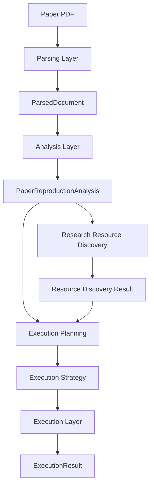
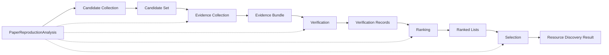

# Research Resource Discovery — Architecture Design

**Project:** Man1Lab  
**Version:** Design draft  
**Status:** Design Only — no implementation commitment  
**Audience:** Architects, platform maintainers  
**Horizon:** Platform Capability (v1.2+)  
**Last updated:** 2026-06-30

Related documents:

- [ARCHITECTURE.md](../architecture/ARCHITECTURE.md) — platform layers and canonical object
- [ADR-0009](../adr/ADR-0009-Analysis-Canonical-Artifact.md) — `PaperReproductionAnalysis`
- [CURRENT_STATUS.md](../CURRENT_STATUS.md) — v1.2 roadmap
- [infrastructure.md](../architecture/infrastructure.md) — adoption governance

---

## Executive Summary

**Research Resource Discovery** is a dedicated platform layer that resolves *what external engineering resources exist* for a paper reproduction — before execution planning commits to a strategy.

Discovery is **not** GitHub Search. Search returns URLs; Discovery returns **verified, ranked, evidence-backed resource selections** grounded in `PaperReproductionAnalysis`.

```text
PaperReproductionAnalysis
        ↓
Research Resource Discovery
        ↓
Execution Planning          ← future layer (v1.2+)
        ↓
Execution
```

This document defines problem scope, capability boundaries, pipeline placement, resource taxonomy, internal stages, design principles, and evolution path. It does **not** specify APIs, classes, or implementation code.

---

## 1. Problem Statement

### 1.1 Why Repository Discovery Exists

Paper reproduction rarely depends on the PDF alone. Real engineering requires **external resources** the paper may omit, under-specify, or scatter across the web:

| Gap type | Typical need |
|----------|--------------|
| Official code repository | Training scripts, configs, project structure |
| Checkpoints / weights | Pretrained or paper-reported models |
| Datasets | Download links, splits, preprocessing scripts |
| Project pages | Demos, supplementary material, benchmark tables |
| Community forks | Unofficial but widely used reimplementations |

`PaperReproductionAnalysis` records what the paper **states** and what it **does not state** (`reproduction_gaps`). Analysis is intentionally **paper-grounded** — it does not search the open web, verify link liveness, or judge repository quality.

Without Discovery, downstream stages inherit **unresolved gaps** and must either guess (violating paper-first principles) or generate from scratch (high failure rate, as seen in v1.1 benchmarks).

Discovery exists to **close the engineering resource gap** between *paper understanding* and *execution commitment*.

### 1.2 Why Analysis Cannot Go Directly to Planner / Execution Planning

Analysis answers: *What does the paper say is needed, and what does it fail to state?*

It does **not** answer:

| Question | Owner |
|----------|-------|
| Which GitHub repo is the official implementation? | Discovery |
| Is this repo still maintained and runnable? | Discovery |
| Does this checkpoint match the paper's reported model? | Discovery |
| Which of three candidate repos best matches method + evaluation? | Discovery |
| How should we combine repo + checkpoint + dataset? | Execution Planning (future) |

Sending Analysis directly to Planning (v1.1 `TaskModel` generation) or Execution Planning forces the Planner to **infer missing resources** or **assume greenfield code generation**. That conflates three distinct concerns:

1. **Understanding** (Analysis)
2. **Resource resolution** (Discovery)
3. **Engineering strategy** (Planning / Execution Planning)

Separating Discovery preserves [ADR-0009](../adr/ADR-0009-Analysis-Canonical-Artifact.md): Analysis remains the single canonical interpretation of the paper; Discovery **augments** it with externally verified facts without rewriting analysis modules.

### 1.3 Discovery's Role in the Pipeline

Discovery sits **after Analysis** and **before Execution Planning**:

| Responsibility | Detail |
|----------------|--------|
| **Consume** | `PaperReproductionAnalysis` — metadata, goal, resources, method, evaluation, `reproduction_gaps` |
| **Produce** | A structured **Resource Discovery Result** — ranked candidates, evidence, verification status, and selected resources per gap category |
| **Bridge** | Turn `reproduction_gaps` (especially `repository`, `checkpoint`, `dataset_link`, `config`) into actionable external references |
| **Protect downstream** | Execution Planning receives verified selections, not raw search hits |

Discovery does **not** change the canonical analysis object. It produces a **separate artifact** that references analysis and adds externally sourced, evidence-backed resource bindings.

---

## 2. Capability Boundary

### 2.1 Discovery Is Responsible For

| Capability | Meaning |
|------------|---------|
| **Candidate Collection** | Gather plausible resource URLs and identifiers from paper links, metadata (title, authors, arXiv ID), and controlled external indexes |
| **Evidence Collection** | Attachments that support or refute each candidate (README claims, citation match, file tree signals, model card text, commit recency) |
| **Verification** | Check candidate viability: link reachable, repo identity matches paper, license present, basic structural signals (train script exists, config present) |
| **Ranking** | Order candidates by evidence strength, officiality, alignment with analysis modules, and reproduction scope |
| **Selection** | Choose primary (and optional fallback) resources per gap; record confidence and unresolved gaps |

### 2.2 Discovery Is Not Responsible For

| Out of scope | Correct owner |
|--------------|---------------|
| **Clone** repository | Execution / Environment layer |
| **Install** dependencies | Environment Generation (v1.2+) |
| **Execute** training or evaluation | Execution layer |
| **Modify** repository source | Repository Adaptation (future) |
| **Generate** code from scratch | Implementation (Coder) layer |
| **Download** datasets into workspace | Execution / Environment layer |
| **Re-read** or **rewrite** the paper | Analysis layer |
| **Define** engineering task order | Planning / Execution Planning |

Discovery **finds and validates** resources. It does **not** operate them.

### 2.3 Module Boundary Diagram

```text
┌──────────────────────────────────────────────────────────────────────┐
│  ANALYSIS LAYER (existing)                                          │
│  Input: ParsedDocument  →  Output: PaperReproductionAnalysis          │
│  Scope: paper-stated facts + recorded gaps                          │
└───────────────────────────────┬──────────────────────────────────────┘
                                ↓
┌──────────────────────────────────────────────────────────────────────┐
│  RESEARCH RESOURCE DISCOVERY (this design)                            │
│  Input:  PaperReproductionAnalysis                                    │
│  Output: Resource Discovery Result                                  │
│  Scope: collect → evidence → verify → rank → select                 │
└───────────────────────────────┬──────────────────────────────────────┘
                                ↓
┌──────────────────────────────────────────────────────────────────────┐
│  EXECUTION PLANNING (future)                                          │
│  Input:  PaperReproductionAnalysis + Resource Discovery Result        │
│  Output: Execution Strategy (how to reproduce using selected resources)│
└───────────────────────────────┬──────────────────────────────────────┘
                                ↓
┌──────────────────────────────────────────────────────────────────────┐
│  EXECUTION LAYER (existing)                                           │
│  Clone, install, run, verify                                          │
└──────────────────────────────────────────────────────────────────────┘
```

**Adjacent layers (unchanged by Discovery design):**

- **Planning / Coder (v1.1):** May continue to run without Discovery when gaps are acceptable or user supplies resources manually. Discovery becomes **required** when gaps block reproduction.
- **Review / Report:** Consume discovery outcome as audit trail (what was found, why selected, what remains unresolved).

---

## 3. Pipeline Placement

### 3.1 Target End-to-End Flow

```text
Paper (PDF)
    ↓ Parsing
ParsedDocument
    ↓ Analysis
PaperReproductionAnalysis
    ↓ Research Resource Discovery
Resource Discovery Result
    ↓ Execution Planning
Execution Strategy
    ↓ Execution (+ Environment)
ExecutionResult
    ↓ Verification → Review → Report
```

### 3.2 Stage Contract

| Stage | Input | Output | Primary responsibility |
|-------|-------|--------|------------------------|
| **Analysis** | `ParsedDocument` | `PaperReproductionAnalysis` | Extract paper-stated reproduction facts; record gaps |
| **Research Resource Discovery** | `PaperReproductionAnalysis` | **Resource Discovery Result** | Find, verify, rank, and select external engineering resources |
| **Execution Planning** | `PaperReproductionAnalysis`, Resource Discovery Result | **Execution Strategy** | Decide reproduction path: use official repo vs fork vs generate; bind checkpoints and datasets |
| **Execution** | Execution Strategy, selected resources | `ExecutionResult` | Clone, install, run, capture logs |

### 3.3 Resource Discovery Result (conceptual)

Design-time description only — not a schema or API:

| Section | Contents |
|---------|----------|
| **provenance** | Analysis reference, discovery run metadata, backends used |
| **candidates** | Full candidate set per resource type (retained, not discarded after selection) |
| **evidence** | Per-candidate evidence records with source and timestamp |
| **verification** | Pass / partial / fail per candidate with reasons |
| **rankings** | Ordered lists per gap category with scoring rationale |
| **selections** | Primary and fallback choices per gap |
| **unresolved_gaps** | Gaps that remain open after discovery with recommended next action |

### 3.4 Relationship to v1.1 Pipeline

v1.1 runs: Analysis → Planning → Coder → Execution without Discovery. That path remains valid for papers with complete in-paper resources or user-provided URLs.

v1.2 introduces Discovery as an **optional but recommended** stage when `reproduction_gaps` indicate missing repository, checkpoint, dataset, or config resources. The workflow coordinator decides whether to invoke Discovery based on gap categories and reproduction scope — not on every run unconditionally.

---

## 4. Resource Scope

Resources are tiered by **reproduction criticality** and **integration maturity**, not by search engine popularity.

### 4.1 Tier 1 — Primary Reproduction Resources

Resources directly required to reproduce paper claims. Discovery prioritizes Tier 1.

| Resource type | Role in reproduction |
|---------------|---------------------|
| **Official Repository** | Author-maintained code; highest trust when verified |
| **Community Repository** | Widely cited reimplementation; ranked below official when both exist |
| **Project Page** | Paper homepage; may link repo, data, demos |
| **Checkpoint** | Weights required for training continuation or inference/eval |
| **Config** | Training/eval configuration files referenced or implied by method |

**Why Tier 1:** Without at least one viable Tier 1 resource, Execution Planning cannot anchor on existing engineering artifacts. Greenfield generation becomes the fallback — highest cost and highest failure rate.

### 4.2 Tier 2 — Supporting Distribution Resources

Resources that package or distribute Tier 1 assets but are not the primary code home.

| Resource type | Role |
|---------------|------|
| **HuggingFace** | Model weights, tokenizers, datasets, inference APIs |
| **Docker** | Prebuilt runtime images referencing paper code |
| **Model Card** | Structured metadata linking model ↔ paper ↔ eval protocol |

**Why Tier 2:** Many papers publish code on GitHub but weights on HuggingFace, or ship Docker for demo only. Discovery must **link** Tier 2 assets to Tier 1 repos via evidence (same model name, citation, SHA reference) rather than treat them as independent candidates.

Tier 2 alone is **insufficient** for full training reproduction unless Execution Planning explicitly scopes to inference/eval-only (`goal.scope`).

### 4.3 Tier 3 — Future Resources

Reserved for later platform capability. Discovery architecture must not assume these exist today.

| Resource type | Notes |
|---------------|-------|
| **Zenodo / Figshare** | Dataset and artifact archives |
| **Papers With Code** | Benchmark leaderboard links |
| **Conda / PyPI packages** | Published library versions tied to paper |
| **Cloud notebooks (Colab, Kaggle)** | Ephemeral demo environments |
| **Institutional mirrors** | Region-specific dataset hosting |

**Why Tier 3 deferred:** Each requires distinct verification rules and adoption review per [infrastructure.md](../architecture/infrastructure.md). Tier 3 backends plug in behind Discovery ports without changing the internal pipeline stages.

### 4.4 Tier Summary

```text
Tier 1  ──►  Must resolve for most reproduction scopes
Tier 2  ──►  Bind to Tier 1; critical for weights/data packaging
Tier 3  ──►  Future adapters; same pipeline stages apply
```

---

## 5. Internal Pipeline

Discovery runs a **five-stage internal pipeline**. Each stage is a logical step; implementation may batch or parallelize within governance rules.

```text
Candidate Collection
        ↓
Evidence Collection
        ↓
Verification
        ↓
Ranking
        ↓
Selection
```

### 5.1 Candidate Collection

| | |
|--|--|
| **Input** | `PaperReproductionAnalysis` — especially `metadata`, `resources.external_resources`, `resources.artifacts`, `reproduction_gaps` |
| **Output** | **Candidate Set** — unverified resource references tagged by tier and gap category |
| **Responsibility** | Enumerate *plausible* resources without judging quality |

**Activities:**

- Seed from paper-stated URLs in `resources` and `external_resources`
- Expand from metadata signals (title + authors + arXiv ID + venue/year)
- Query controlled external indexes (not raw "GitHub search box" semantics — structured lookup by paper identity)
- Include community repos only when linked from paper, citation graph, or project page

**Failure handling:**

| Condition | Action |
|-----------|--------|
| Zero candidates for critical gap | Emit empty candidate set; flag `unresolved_gaps`; do not fabricate URLs |
| Duplicate URLs | Deduplicate; preserve all discovery sources in provenance |
| Index backend unavailable | Continue with paper-seeded candidates; record backend degradation |
| Rate limit / timeout | Retry with backoff; partial candidate set is valid output |

### 5.2 Evidence Collection

| | |
|--|--|
| **Input** | Candidate Set + `PaperReproductionAnalysis` |
| **Output** | **Evidence Bundle** per candidate |
| **Responsibility** | Gather *observable facts* that support or refute candidacy |

**Evidence types (non-exhaustive):**

| Evidence | Supports |
|----------|----------|
| README cites same arXiv ID / title | Officiality |
| `train.py` / `main.py` / config files present | Runnable structure |
| License file present | Legal usability |
| Last commit date | Maintenance signal |
| Stars/forks (weak signal) | Community adoption — never sole criterion |
| Model card lists same benchmark metrics | Tier 2 ↔ paper alignment |
| Author org match | Identity confirmation |

**Failure handling:**

| Condition | Action |
|-----------|--------|
| Page fetch fails | Mark evidence incomplete; candidate proceeds to Verification as `partial` |
| Contradictory evidence | Record both; do not resolve by guessing — Ranking decides |
| LLM summarization unavailable | Rely on deterministic extracts (HTTP metadata, file listing) only |

### 5.3 Verification

| | |
|--|--|
| **Input** | Candidate Set + Evidence Bundle + `PaperReproductionAnalysis` |
| **Output** | **Verification Record** per candidate (`pass`, `partial`, `fail`) |
| **Responsibility** | Apply reproducibility-relevant checks before ranking |

**Verification dimensions:**

| Check | Intent |
|-------|--------|
| **Reachability** | URL resolves; repo not deleted/private without access path |
| **Identity** | Resource plausibly belongs to this paper (not name collision) |
| **Scope alignment** | Repo supports `goal.scope` (training vs inference-only) |
| **Structural viability** | Minimum signals for intended reproduction path exist |
| **License** | Usable for automated reproduction workflow |

Verification is **shallow** by design — clone and execute are out of scope. "Pass" means *worthy of selection consideration*, not *guaranteed runnable*.

**Failure handling:**

| Condition | Action |
|-----------|--------|
| All candidates fail verification | No selection for that gap; escalate to `unresolved_gaps` |
| Partial pass | Candidate remains in ranked set with explicit limitations |
| Verification backend error | Fail closed for that candidate; do not auto-promote |

### 5.4 Ranking

| | |
|--|--|
| **Input** | Verified candidates + Evidence Bundle + `PaperReproductionAnalysis` |
| **Output** | **Ranked Lists** per gap category |
| **Responsibility** | Order candidates by reproduction suitability |

**Ranking factors (ordered by weight):**

1. **Evidence strength** — paper citation, author match, explicit "official" label
2. **Officiality** — author/org repo over anonymous fork
3. **Scope match** — training-capable repo for `FULL_REPRODUCTION` / `TRAINING` scope
4. **Verification status** — pass before partial before fail
5. **Recency / maintenance** — tie-breaker only
6. **Tier** — Tier 1 before Tier 2 when serving same gap

Ranking produces **ordered lists**, not a single winner yet. The full ranked list is retained.

**Failure handling:**

| Condition | Action |
|-----------|--------|
| Tie scores | Retain all tied candidates; Selection picks primary + fallback |
| No verified candidates | Empty ranking; document reason |
| Conflicting official repos | Rank both; Selection may choose primary + fallback with human-review flag |

### 5.5 Selection

| | |
|--|--|
| **Input** | Ranked Lists + `PaperReproductionAnalysis` |
| **Output** | **Resource Discovery Result** — primary selections, fallbacks, unresolved gaps |
| **Responsibility** | Commit to resources Execution Planning will consume |

**Selection rules:**

- One **primary** selection per gap category when ranking supports it
- Optional **fallback** when second candidate passes verification with lower score
- Never select a candidate that failed verification unless user override (future human-in-the-loop)
- Preserve **full candidate set and rankings** in result — Selection does not delete history

**Failure handling:**

| Condition | Action |
|-----------|--------|
| No selectable resource | Record gap as unresolved; Execution Planning may choose generate-from-scratch or abort |
| Selected resource contradicts paper-stated URL | Prefer paper-stated URL if verification passes; log discrepancy |
| Low confidence selection | Include in result with confidence flag; do not block pipeline by default |

---

## 6. Design Principles

| Principle | Application in Discovery |
|-----------|-------------------------|
| **Evidence over Guessing** | Every selection traces to collected evidence. No URL invented to fill a gap. |
| **Verification before Selection** | Ranking and Selection operate on verified (or explicitly partial) candidates only. |
| **Thin Integration** | External indexes (GitHub API, HuggingFace, HTTP fetch) sit behind Discovery ports — same pattern as Docling and MLflow in v1.1. |
| **Canonical Object First** | Discovery reads `PaperReproductionAnalysis`; it does not fork a parallel paper model. |
| **Keep Candidate Set** | Full candidate history retained for audit, rerun, and human review — not just the winner. |
| **No Vendor Lock-in** | Multiple backends per tier; ADR required before adoption per infrastructure governance. |
| **Paper-first, externally augmented** | Paper-stated URLs are seeds with highest prior; external findings augment, not override, unless paper link is dead and evidence supports alternative. |
| **Scope-aware** | `goal.scope` drives which resource types are mandatory vs optional. |
| **Fail transparently** | Unresolved gaps are first-class outputs, not silent omissions. |
| **Separation from execution** | Discovery never clones, installs, or runs — preserving clean failure attribution. |

---

## 7. Future Work

Discovery is the **first Platform Capability layer** in v1.2. Downstream evolution builds on its output without repeating resource search.

### 7.1 Execution Planning

| Aspect | Direction |
|--------|-----------|
| **Input** | `PaperReproductionAnalysis` + Resource Discovery Result |
| **Decision** | Official repo path vs community fork vs hybrid vs greenfield generation |
| **Output** | Execution Strategy binding repos, checkpoints, datasets, and entry commands |
| **Relationship** | Consumes Discovery selections; does not re-search |

### 7.2 Repository Analysis

| Aspect | Direction |
|--------|-----------|
| **Purpose** | Shallow structural analysis of selected repo (entry points, dependency manifests, config layout) |
| **When** | After Selection, before or during Execution Planning |
| **Boundary** | Read-only inspection — still no clone required for initial analysis (metadata APIs, sparse file fetch) |

### 7.3 Repository Understanding

| Aspect | Direction |
|--------|-----------|
| **Purpose** | Semantic mapping between repo structure and `PaperReproductionAnalysis` modules (method, evaluation) |
| **When** | After Repository Analysis, informs Execution Planning and optional Coder context |
| **Boundary** | Understanding only — no code modification |

### 7.4 Repository Adaptation

| Aspect | Direction |
|--------|-----------|
| **Purpose** | Apply patches, pin versions, or fork to align discovered repo with paper requirements |
| **When** | After Execution Planning commits to a repo-based strategy |
| **Boundary** | Owned by Implementation / patch workflow — not Discovery |

### 7.5 Evolution Roadmap

```text
v1.1  Foundation          Analysis → Planning → Coder → Execution
v1.2  Discovery           Analysis → Discovery → Execution Planning → Execution
v1.3  Repo Understanding  Discovery → Repo Analysis → Repo Understanding → Adaptation
```

Each stage produces a **typed artifact**. No stage re-parses the PDF for reproduction facts.

---

## 8. Architecture Diagram

### 8.1 Platform Context



### 8.2 Discovery Internal Pipeline



### 8.3 Capability Summary

| Layer | Finds resources | Verifies resources | Selects resources | Operates resources |
|-------|-----------------|--------------------|--------------------|--------------------|
| Analysis | — | — | — | — |
| **Discovery** | ✅ | ✅ | ✅ | — |
| Execution Planning | — | — | Strategy | — |
| Execution | — | — | — | ✅ |
| Coder (v1.1) | — | — | — | Generates new |

---

## 9. Open Questions (Design Backlog)

Items for future ADR or spike — not blockers for this architecture document.

| Question | Notes |
|----------|-------|
| Mandatory vs optional Discovery invocation | Trigger on gap categories, scope, or user flag? |
| Human-in-the-loop selection override | When confidence is low, pause or continue with flag? |
| Caching and reproducibility | Store discovery snapshots per paper run (MLflow artifact?) |
| Multi-repo papers | Papers with separate data/code/eval repos — selection model |
| Non-GitHub official sources | GitLab, Bitbucket, institutional hosting — same pipeline, different adapters |
| Legal / license hard blocks | GPL vs commercial API keys — governance policy |

---

## Document Maintenance

| Event | Action |
|-------|--------|
| Discovery implementation begins | Create ADR; move status from Design Only to Accepted |
| Execution Planning designed | Cross-link companion design doc |
| New resource tier added | Update §4; require infrastructure adoption review |
| Backend adopted (e.g. GitHub API) | Update infrastructure matrix; no change to internal pipeline stages |

**Status:** Design Only — no Python, prompt, or runtime changes in this task.
